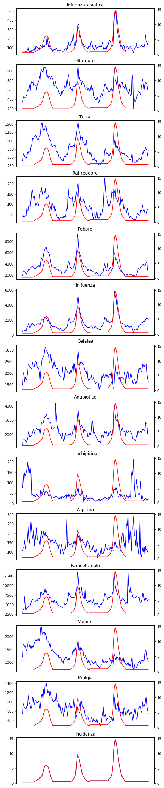
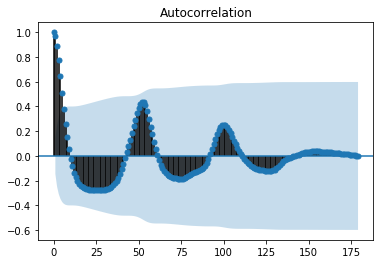
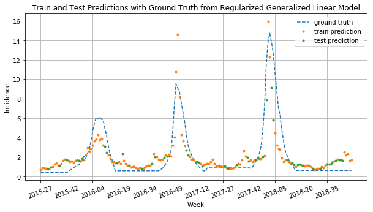
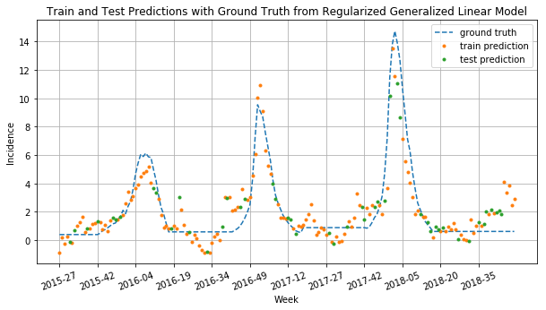
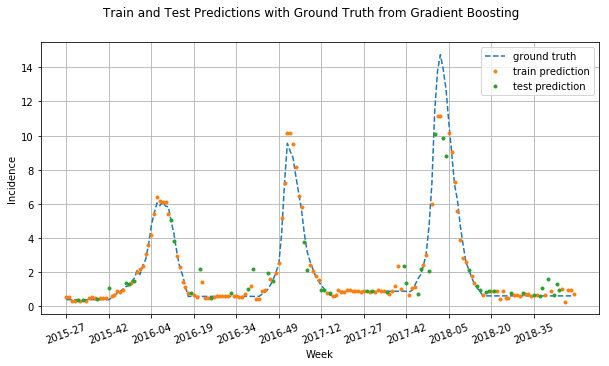
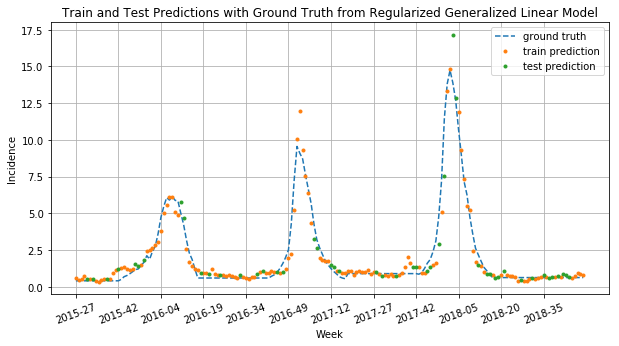
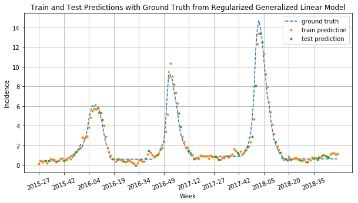
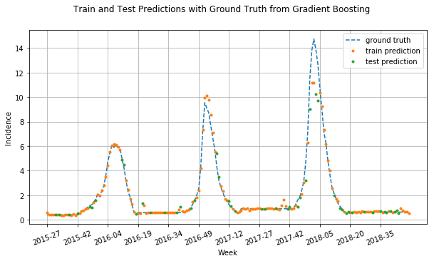

# Digital Epidemiology
## Homework 1 - Influenza Forecasting from Wikipedia Page Counts

### Abstract

Infectious disease is a leading threat to public health, economic stability, and many other social structures. Efforts to mitigate these impacts depend on accurate and timely monitoring so as the risk and the progress of a disease can be measured. Since new techniques based on social internet data, such as social media and search queries are emerging one may think to derive some fruitful results. Indeed although such efforts are promising,often important challenges in the areas of scientific review, breadth of diseases and countries, and forecasting may hinder their operational usefulness. For this use,focused on estimating the Ifluenza incidents (which in certain periods are given) we examine an available, open data source, the Italian Wikipedia.By downloading raw data roughly from 2014 untill 2018 in the context of Influenza, we saved in each .csv file relevant pageview word counts such as : infuenza,influenzaasiatica,febbre,paracetamolo,aspirina,tosse,antibiotico,tachipirina,paracetamolo,cefalea,vomito, and mialgia. Our goal is, via performing a model, to estimate the true pattern of Influenza incidence using current data so as to be in a position to forecast.


Import the necessary libraries


```python
import pandas as pd
from datetime import datetime
import matplotlib.pyplot as plt
import numpy as np
from statsmodels.graphics import tsaplots
from tabulate import tabulate

import h2o
from h2o.estimators.glm import H2OGeneralizedLinearEstimator
from h2o.estimators.gbm import H2OGradientBoostingEstimator
from h2o.estimators import H2OXGBoostEstimator
from h2o.grid.grid_search import H2OGridSearch

h2o.init()
#h2o.cluster().shutdown() # this has to be run just in case the memory on h2o custer expires
```

    Checking whether there is an H2O instance running at http://localhost:54321..... not found.
    Attempting to start a local H2O server...
    ; OpenJDK 64-Bit Server VM (build 25.152-b12, mixed mode)56-b12)
      Starting server from C:\Users\Mattia\Miniconda3\lib\site-packages\h2o\backend\bin\h2o.jar
      Ice root: C:\Users\Mattia\AppData\Local\Temp\tmpfscpxp2d
      JVM stdout: C:\Users\Mattia\AppData\Local\Temp\tmpfscpxp2d\h2o_Mattia_started_from_python.out
      JVM stderr: C:\Users\Mattia\AppData\Local\Temp\tmpfscpxp2d\h2o_Mattia_started_from_python.err
      Server is running at http://127.0.0.1:54321
    Connecting to H2O server at http://127.0.0.1:54321... successful.
    


<div style="overflow:auto"><table style="width:50%"><tr><td>H2O cluster uptime:</td>
<td>05 secs</td></tr>
<tr><td>H2O cluster timezone:</td>
<td>Europe/Berlin</td></tr>
<tr><td>H2O data parsing timezone:</td>
<td>UTC</td></tr>
<tr><td>H2O cluster version:</td>
<td>3.22.0.2</td></tr>
<tr><td>H2O cluster version age:</td>
<td>26 days </td></tr>
<tr><td>H2O cluster name:</td>
<td>H2O_from_python_Mattia_06jne7</td></tr>
<tr><td>H2O cluster total nodes:</td>
<td>1</td></tr>
<tr><td>H2O cluster free memory:</td>
<td>1.754 Gb</td></tr>
<tr><td>H2O cluster total cores:</td>
<td>4</td></tr>
<tr><td>H2O cluster allowed cores:</td>
<td>4</td></tr>
<tr><td>H2O cluster status:</td>
<td>accepting new members, healthy</td></tr>
<tr><td>H2O connection url:</td>
<td>http://127.0.0.1:54321</td></tr>
<tr><td>H2O connection proxy:</td>
<td>None</td></tr>
<tr><td>H2O internal security:</td>
<td>False</td></tr>
<tr><td>H2O API Extensions:</td>
<td>Algos, AutoML, Core V3, Core V4</td></tr>
<tr><td>Python version:</td>
<td>3.6.6 final</td></tr></table></div>


### Functions for Part 1 - 2

Building dataframe by eventually formating the daily dates to weeks.
We perform this operation both for the official flu incidence and the features we previously saved.


```python
def load_influnet(path1, path2, path3, path4):
    '''Takes official Influnet data (ground truth) from a list of csv files 
    It returns a unique dataframe - ground_truth - in which Influnet data (our ground truth) is indexed by week
    '''
    ground_truth1 = pd.read_csv(path1, sep = ';', decimal=',')
    
    ground_truth2 = pd.read_csv(path2, header=1, sep = ';', decimal=',')
    ground_truth2 = (ground_truth2[['Unnamed: 0','Incidenza']])
    ground_truth2.columns = ground_truth2.columns.str.replace('Unnamed: 0', "Settimana")
    
    ground_truth3 = pd.read_csv(path3, header=2, sep = ',', decimal=',')
    ground_truth3 = (ground_truth3[['Unnamed: 0','Totale']])
    ground_truth3.columns = ground_truth3.columns.str.replace('Unnamed: 0', "Settimana")
    ground_truth3.columns = ground_truth3.columns.str.replace('Totale', "Incidenza")
    
    ground_truth4 = pd.read_csv(path4, header=2, decimal=',')
    ground_truth4 = (ground_truth4[['Unnamed: 0','Totale']])
    ground_truth4.columns = ground_truth4.columns.str.replace('Unnamed: 0', "Settimana")
    ground_truth4.columns = ground_truth4.columns.str.replace('Totale', "Incidenza")
    
    ground_truth = pd.concat([ground_truth4, ground_truth3, ground_truth2, ground_truth1])
    ground_truth.set_index('Settimana', inplace = True)
    ground_truth.index.rename('Week', inplace=True)
    
    return ground_truth
```


```python
def load_pageviews(path):
    '''This function takes a Wikipedia term as an input.
    It returns a dataframe indexed by a string in the format Year-WeekNumber. The dataframe columnn are Wikipedia 
    web counts relative to the aforementioned term
    '''
    wik = pd.read_csv(path)
    wik.Date = pd.to_datetime(wik.Date).dt.strftime('%G-%V')
    group = wik.groupby(wik.Date).sum()
    week = np.array(group.index)
    count = group.values
    a = pd.DataFrame({'Week': week.ravel(), 'Count': count.ravel()})
    a.set_index('Week', inplace = True)
    return a

def dataMergingAndPreprocessing(official_data, wiki_terms):
    '''This function merges data coming from Influnet with data about Wikipidia pageviews
    '''
    paths = ['.//data//'+i+'.csv' for i in terms.split(', ', )]
    dbs = map(lambda x : load_pageviews(x), paths)
    data = pd.concat([i for i in dbs], join='outer', axis=1, sort = True)
    data.columns = [x.capitalize() for x in terms.split(', ')]
    data = pd.merge(data, ground_truth, how='outer', right_index=True, left_index= True ,sort=True)
    data = data.loc['2015-26':]
    data.fillna(inplace=True, method = 'bfill')
    data.fillna(inplace=True, method = 'ffill')
    data.reset_index(inplace=True)
    
    return data
```

The imputation of the missing values regarding our ground truth was done using backward and forward filling, since we assumed that the incidence of flu is reported in Influnet's reports only for a week in which it is reasonable to do it, i.e. during the remaining periods of the year it is supposed to remain constant.


```python
def dataShifting(data , what = [], how = []):
    '''This function adds a list of new features in our dataframe, specifically, it adds a list of times series already
    in the dataframe (as columns obviously) shifted by an offset
    input: 
        data: a dataframe;
        what: list of columns of the dataframe to be shifted
        how : list of period used to do the shift
    output : data: dataframe with added columns
    '''
    for i in range(len(what)):
        col_name = what[i] + '+' + str(how[i])
        if col_name not in data.columns:
            shifted = data[what[i]].shift(how[i])
            data.insert(loc = 1, column = col_name, value = shifted, allow_duplicates=False)
    data.fillna(inplace=True, method = 'bfill')
    
    return data
```

The function below was used for plotting the Wikipedia pageview data together with Influnet official data


```python
def plot_data(data, ignore = 1):
    '''Plot data retrieved from Wikipedia together with Influnet official data
    input:  dataframe. The column with official data must be named "Incidenza"
            ignore: ignore first i columns in the data frame
    output: void... it prints plot on stdout
    
    note : left y axis refers to the feature, right y axis refers to the Influnet data
    '''
    fig, axes = plt.subplots(nrows=data.shape[1]-ignore, ncols=1, figsize = (7,40))

    for i in range(ignore,int(data.shape[1])):
        data[data.columns[i]].plot(ax=axes[i-1], color = "b", title= data.columns[i])
        data['Incidenza'].plot(ax=axes[i-1], secondary_y = True, color = 'r')
        
        axes[i-1].xaxis.set_visible(False)

    plt.show()
    
    return 1
```

### Functions for Part 3

Splitting the dataset in train and test set


```python
def split_train_test(dataframe, p):
    '''Divides train set and test set
    input: dataframe to be splitted, p = probability of an assignment to train test
    output: train set, test set, lists containing indices for training and test set'''
    nrows = dataframe.shape[0]
    nrows_train = int(nrows*p)
    
    np.random.seed(123)
    indices_train = np.random.choice([True, False], nrows, p = [p, 1-p])
    indices_test = np.logical_not(indices_train)

    train = dataframe[indices_train]
    test = dataframe[indices_test]
    
    return train, test
```

Design of the generalized linear model


```python
def RegularizedGeneralizedLinearModel(data, family = 'poisson', p = 0.7, nfolds = 10):
    
    # split train and test data
    X_train, X_test = split_train_test(dataframe=data, p=p)
    X_train_h2o = h2o.H2OFrame(X_train.sort_index())
    X_test_h2o = h2o.H2OFrame(X_test.sort_index())

    # divide columns in features and predictor
    features = list(data.columns)
    y = 'Incidenza'
    # removes useless columns from the features
    features.remove(y)        
    features.remove('Week')
    print('Features:\n', features)

    mod = H2OGeneralizedLinearEstimator(family = family, nfolds = nfolds, lambda_search = True, seed = 1, standardize = True)
    # set a grid of alpha - alpha = 0 is ridge regression - alpha = 1 is lasso regression
    alphas = list(np.arange(0,1, 0.3)) 
    hyp_par = {"alpha" : alphas}
    grid = H2OGridSearch(mod, hyper_params=hyp_par)  
    grid.train(x = features, y = y, training_frame=X_train_h2o, validation_frame=X_test_h2o)
    
    # take the best model from the ensemble trained with the hyperparameters grid
    best_model = grid.get_grid().models[0]

    y_pred_train = best_model.predict(X_train_h2o).as_data_frame()
    y_pred_test = best_model.predict(X_test_h2o).as_data_frame()
    
    X_train.insert(loc = 0, column = 'Train_Prediction', value = y_pred_train.values)
    X_test.insert(loc = 0, column = 'Test_Prediction', value = y_pred_test.values)
    
    plt.figure(figsize=(10, 5))
    data = pd.concat([X_train, X_test], sort=False).sort_index().set_index('Week')
    data.Incidenza.plot(label = 'ground truth', style='--')
    data.Train_Prediction.plot(label = 'train prediction', style='.')
    data.Test_Prediction.plot(label = 'test prediction', style='.')
    xticks_frequency = 15
    plt.xticks(np.arange(data.shape[0])[::xticks_frequency], data.index[::xticks_frequency], rotation=20)
    plt.grid()
    plt.title('Train and Test Predictions with Ground Truth from Regularized Generalized Linear Model')
    plt.ylabel('Incidence')
    plt.legend()
    plt.show()
 
    MSE = best_model.mse(valid=True)
    RMSE = best_model.rmse(valid=True)
    R2 = best_model.r2(valid=True)
    MAE = best_model.mae(valid=True)
    print('Test Set MSE : ', MSE)
    print('Test Set RMSE : ', RMSE)
    print('Test Set R2 : ', R2)
    print('MAE',MAE)
    
    print('\nTop Coefficients : \n', sorted(best_model.coef().items(), key=lambda kv: abs(kv[1]), reverse=True)[1:10])

    return best_model
```

Gradient Boosting model design


```python
def GradientBoosting(data , p = 0.7):
    
    X_train, X_test = split_train_test(data, p)
    X_train_h2o = h2o.H2OFrame(X_train.sort_index())
    X_test_h2o = h2o.H2OFrame(X_test.sort_index())

    # divide columns in features and predictor
    features = list(data.columns)
    y = 'Incidenza'
    features.remove(y)        # remove useless columns from the features
    features.remove('Week')
    print('Features:\n', features)

    mod = H2OGradientBoostingEstimator(nfolds = 10, seed = 123)
    
    hyp_par = {'learn_rate': [0.01, 0.1], 
                'max_depth': [3, 5, 9],
                'sample_rate': [0.8, 1.0],
                'col_sample_rate': [0.2, 0.5, 1.0],
                'distribution' : 'AUTO'}
    grid = H2OGridSearch(mod, hyper_params=hyp_par)
    grid.train(x = features, y = y, training_frame=X_train_h2o, validation_frame=X_test_h2o)
    
    # take the best model from the ensemble trained with the hyperparameters grid
    best_model = grid.get_grid().models[0]

    y_pred_train = best_model.predict(X_train_h2o).as_data_frame()
    y_pred_test = best_model.predict(X_test_h2o).as_data_frame()
    
    X_train.insert(loc = 0, column = 'Train_Prediction', value = y_pred_train.values)
    X_test.insert(loc = 0, column = 'Test_Prediction', value = y_pred_test.values)

    plt.figure(figsize=(10, 5))
    data = pd.concat([X_train, X_test], sort=False).sort_index().set_index('Week')
    data.Incidenza.plot(label = 'ground truth', style='--')
    data.Train_Prediction.plot(label = 'train prediction', style='.')
    data.Test_Prediction.plot(label = 'test prediction', style='.')
    xticks_frequency = 15
    plt.xticks(np.arange(data.shape[0])[::xticks_frequency], data.index[::xticks_frequency], rotation=20)
    plt.suptitle('Train and Test Predictions with Ground Truth from Gradient Boosting')
    plt.ylabel('Incidence')
    plt.grid()
    plt.legend()
    plt.show()   
    
    MSE = best_model.mse(valid=True)
    RMSE = best_model.rmse(valid=True)
    R2 = best_model.r2(valid=True)
    MAE = best_model.mae(valid=True)
    print('Test Set MSE : ', MSE)
    print('Test Set RMSE : ', RMSE)
    print('Test Set R2 : ', R2)
    print('MAE',MAE)
    
    return best_model
```

We process the Wikipedia pageview data for the "Influenza" page and for other words that we think that they are correlated with our ground truth, aggregating the pageviews on a weekly time scale, and plot the resulting time series of page views for the years 2014-42 untill 2018-17 where the dashed integers between years indicate the corresponding weeks.


```python
path1 = './data/tabula-InfluNet - Stagione 2017 - 2018.csv'
path2 = './data/tabula-InfluNet - Stagione 2016 - 2017.csv'
path3 = './data/tabula-InfluNet - Stagione 2015 - 2016.csv'
path4 = './data/tabula-InfluNet - Stagione 2014 - 2015.csv'


# retrieve date from Influnet
ground_truth= load_influnet(path1, path2, path3, path4)

terms = 'infuenza_asiatica, starnuto, tosse, raffreddore, febbre, influenza, cefalea, antibiotico, tachipirina, aspirina, paracetamolo, vomito, mialgia'
# retrieve data from Wikipedia
data = dataMergingAndPreprocessing(official_data = ground_truth, wiki_terms = terms)
data.head()
```


<div>
<style scoped>
    .dataframe tbody tr th:only-of-type {
        vertical-align: middle;
    }

    .dataframe tbody tr th {
        vertical-align: top;
    }

    .dataframe thead th {
        text-align: right;
    }
</style>
<table border="1" class="dataframe">
  <thead>
    <tr style="text-align: right;">
      <th></th>
      <th>Week</th>
      <th>Infuenza_asiatica</th>
      <th>Starnuto</th>
      <th>Tosse</th>
      <th>Raffreddore</th>
      <th>Febbre</th>
      <th>Influenza</th>
      <th>Cefalea</th>
      <th>Antibiotico</th>
      <th>Tachipirina</th>
      <th>Aspirina</th>
      <th>Paracetamolo</th>
      <th>Vomito</th>
      <th>Mialgia</th>
      <th>Incidenza</th>
    </tr>
  </thead>
  <tbody>
    <tr>
      <th>0</th>
      <td>2015-27</td>
      <td>49.0</td>
      <td>336.0</td>
      <td>397.0</td>
      <td>36.0</td>
      <td>1829.0</td>
      <td>493.0</td>
      <td>1490.0</td>
      <td>1251.0</td>
      <td>75.0</td>
      <td>105.0</td>
      <td>2626.0</td>
      <td>1195.0</td>
      <td>736.0</td>
      <td>0.4</td>
    </tr>
    <tr>
      <th>1</th>
      <td>2015-28</td>
      <td>62.0</td>
      <td>419.0</td>
      <td>558.0</td>
      <td>44.0</td>
      <td>2609.0</td>
      <td>642.0</td>
      <td>1927.0</td>
      <td>1697.0</td>
      <td>143.0</td>
      <td>125.0</td>
      <td>3690.0</td>
      <td>1686.0</td>
      <td>968.0</td>
      <td>0.4</td>
    </tr>
    <tr>
      <th>2</th>
      <td>2015-29</td>
      <td>61.0</td>
      <td>464.0</td>
      <td>622.0</td>
      <td>34.0</td>
      <td>2797.0</td>
      <td>646.0</td>
      <td>2040.0</td>
      <td>1692.0</td>
      <td>100.0</td>
      <td>124.0</td>
      <td>3832.0</td>
      <td>1712.0</td>
      <td>915.0</td>
      <td>0.4</td>
    </tr>
    <tr>
      <th>3</th>
      <td>2015-30</td>
      <td>50.0</td>
      <td>440.0</td>
      <td>530.0</td>
      <td>38.0</td>
      <td>2751.0</td>
      <td>584.0</td>
      <td>1634.0</td>
      <td>1631.0</td>
      <td>148.0</td>
      <td>161.0</td>
      <td>7096.0</td>
      <td>1617.0</td>
      <td>868.0</td>
      <td>0.4</td>
    </tr>
    <tr>
      <th>4</th>
      <td>2015-31</td>
      <td>60.0</td>
      <td>439.0</td>
      <td>476.0</td>
      <td>43.0</td>
      <td>2384.0</td>
      <td>554.0</td>
      <td>1826.0</td>
      <td>1597.0</td>
      <td>135.0</td>
      <td>120.0</td>
      <td>3832.0</td>
      <td>1611.0</td>
      <td>862.0</td>
      <td>0.4</td>
    </tr>
  </tbody>
</table>
</div>


```python
plot_data(data)
```





    1


Visualizing the above plot we start to have an initial idea regarding which feature are important for our model.
Features such as `Influenza`,`Influenza_asiatica` and `Febbre` seem to have a good fit with our target.
Others like `Raffreddore`,`Tosse` and `Starnuto` appear to be backward shifted in time,which makes sense as they are more general as symptomps and ususally represent a primitive stage (earlier symptoms) before the incidence-contraction of the virus.
Features like `Aspirina`,`Paracetamolo` and `Tachipirinia`(also shifted a bit backward maybe as a precaution) appear to be forward shifted with respect to our ground truth since they represent a way to cope with the disease.

For each feature in our dataframe , we compute Pearson's correlation r against each other and also the disease incidence time series. We then order the features by decreasing |r| and we obtain each feature correlation with the dependent variable Incidenza.


```python
corr = data.corr()
corr.style.background_gradient()
```


<style  type="text/css" >
    #T_6d8cc7f8_0228_11e9_b82d_ac220b0b8621row0_col0 {
            background-color:  #023858;
        }    #T_6d8cc7f8_0228_11e9_b82d_ac220b0b8621row0_col1 {
            background-color:  #9ebad9;
        }    #T_6d8cc7f8_0228_11e9_b82d_ac220b0b8621row0_col2 {
            background-color:  #b0c2de;
        }    #T_6d8cc7f8_0228_11e9_b82d_ac220b0b8621row0_col3 {
            background-color:  #81aed2;
        }    #T_6d8cc7f8_0228_11e9_b82d_ac220b0b8621row0_col4 {
            background-color:  #529bc7;
        }    #T_6d8cc7f8_0228_11e9_b82d_ac220b0b8621row0_col5 {
            background-color:  #04588a;
        }    #T_6d8cc7f8_0228_11e9_b82d_ac220b0b8621row0_col6 {
            background-color:  #ebe6f2;
        }    #T_6d8cc7f8_0228_11e9_b82d_ac220b0b8621row0_col7 {
            background-color:  #358fc0;
        }    #T_6d8cc7f8_0228_11e9_b82d_ac220b0b8621row0_col8 {
            background-color:  #f8f1f8;
        }    #T_6d8cc7f8_0228_11e9_b82d_ac220b0b8621row0_col9 {
            background-color:  #fff7fb;
        }    #T_6d8cc7f8_0228_11e9_b82d_ac220b0b8621row0_col10 {
            background-color:  #308cbe;
        }    #T_6d8cc7f8_0228_11e9_b82d_ac220b0b8621row0_col11 {
            background-color:  #fff7fb;
        }    #T_6d8cc7f8_0228_11e9_b82d_ac220b0b8621row0_col12 {
            background-color:  #fff7fb;
        }    #T_6d8cc7f8_0228_11e9_b82d_ac220b0b8621row0_col13 {
            background-color:  #046299;
        }    #T_6d8cc7f8_0228_11e9_b82d_ac220b0b8621row1_col0 {
            background-color:  #9ebad9;
        }    #T_6d8cc7f8_0228_11e9_b82d_ac220b0b8621row1_col1 {
            background-color:  #023858;
        }    #T_6d8cc7f8_0228_11e9_b82d_ac220b0b8621row1_col2 {
            background-color:  #05659f;
        }    #T_6d8cc7f8_0228_11e9_b82d_ac220b0b8621row1_col3 {
            background-color:  #167bb6;
        }    #T_6d8cc7f8_0228_11e9_b82d_ac220b0b8621row1_col4 {
            background-color:  #056dab;
        }    #T_6d8cc7f8_0228_11e9_b82d_ac220b0b8621row1_col5 {
            background-color:  #4295c3;
        }    #T_6d8cc7f8_0228_11e9_b82d_ac220b0b8621row1_col6 {
            background-color:  #2484ba;
        }    #T_6d8cc7f8_0228_11e9_b82d_ac220b0b8621row1_col7 {
            background-color:  #0a73b2;
        }    #T_6d8cc7f8_0228_11e9_b82d_ac220b0b8621row1_col8 {
            background-color:  #f7f0f7;
        }    #T_6d8cc7f8_0228_11e9_b82d_ac220b0b8621row1_col9 {
            background-color:  #adc1dd;
        }    #T_6d8cc7f8_0228_11e9_b82d_ac220b0b8621row1_col10 {
            background-color:  #63a2cb;
        }    #T_6d8cc7f8_0228_11e9_b82d_ac220b0b8621row1_col11 {
            background-color:  #358fc0;
        }    #T_6d8cc7f8_0228_11e9_b82d_ac220b0b8621row1_col12 {
            background-color:  #529bc7;
        }    #T_6d8cc7f8_0228_11e9_b82d_ac220b0b8621row1_col13 {
            background-color:  #83afd3;
        }    #T_6d8cc7f8_0228_11e9_b82d_ac220b0b8621row2_col0 {
            background-color:  #a5bddb;
        }    #T_6d8cc7f8_0228_11e9_b82d_ac220b0b8621row2_col1 {
            background-color:  #04639b;
        }    #T_6d8cc7f8_0228_11e9_b82d_ac220b0b8621row2_col2 {
            background-color:  #023858;
        }    #T_6d8cc7f8_0228_11e9_b82d_ac220b0b8621row2_col3 {
            background-color:  #0872b1;
        }    #T_6d8cc7f8_0228_11e9_b82d_ac220b0b8621row2_col4 {
            background-color:  #046299;
        }    #T_6d8cc7f8_0228_11e9_b82d_ac220b0b8621row2_col5 {
            background-color:  #4a98c5;
        }    #T_6d8cc7f8_0228_11e9_b82d_ac220b0b8621row2_col6 {
            background-color:  #056fae;
        }    #T_6d8cc7f8_0228_11e9_b82d_ac220b0b8621row2_col7 {
            background-color:  #1b7eb7;
        }    #T_6d8cc7f8_0228_11e9_b82d_ac220b0b8621row2_col8 {
            background-color:  #f1ebf4;
        }    #T_6d8cc7f8_0228_11e9_b82d_ac220b0b8621row2_col9 {
            background-color:  #9ebad9;
        }    #T_6d8cc7f8_0228_11e9_b82d_ac220b0b8621row2_col10 {
            background-color:  #6da6cd;
        }    #T_6d8cc7f8_0228_11e9_b82d_ac220b0b8621row2_col11 {
            background-color:  #04649e;
        }    #T_6d8cc7f8_0228_11e9_b82d_ac220b0b8621row2_col12 {
            background-color:  #3b92c1;
        }    #T_6d8cc7f8_0228_11e9_b82d_ac220b0b8621row2_col13 {
            background-color:  #86b0d3;
        }    #T_6d8cc7f8_0228_11e9_b82d_ac220b0b8621row3_col0 {
            background-color:  #83afd3;
        }    #T_6d8cc7f8_0228_11e9_b82d_ac220b0b8621row3_col1 {
            background-color:  #187cb6;
        }    #T_6d8cc7f8_0228_11e9_b82d_ac220b0b8621row3_col2 {
            background-color:  #1077b4;
        }    #T_6d8cc7f8_0228_11e9_b82d_ac220b0b8621row3_col3 {
            background-color:  #023858;
        }    #T_6d8cc7f8_0228_11e9_b82d_ac220b0b8621row3_col4 {
            background-color:  #1b7eb7;
        }    #T_6d8cc7f8_0228_11e9_b82d_ac220b0b8621row3_col5 {
            background-color:  #197db7;
        }    #T_6d8cc7f8_0228_11e9_b82d_ac220b0b8621row3_col6 {
            background-color:  #96b6d7;
        }    #T_6d8cc7f8_0228_11e9_b82d_ac220b0b8621row3_col7 {
            background-color:  #5c9fc9;
        }    #T_6d8cc7f8_0228_11e9_b82d_ac220b0b8621row3_col8 {
            background-color:  #f9f2f8;
        }    #T_6d8cc7f8_0228_11e9_b82d_ac220b0b8621row3_col9 {
            background-color:  #d9d8ea;
        }    #T_6d8cc7f8_0228_11e9_b82d_ac220b0b8621row3_col10 {
            background-color:  #569dc8;
        }    #T_6d8cc7f8_0228_11e9_b82d_ac220b0b8621row3_col11 {
            background-color:  #83afd3;
        }    #T_6d8cc7f8_0228_11e9_b82d_ac220b0b8621row3_col12 {
            background-color:  #ced0e6;
        }    #T_6d8cc7f8_0228_11e9_b82d_ac220b0b8621row3_col13 {
            background-color:  #65a3cb;
        }    #T_6d8cc7f8_0228_11e9_b82d_ac220b0b8621row4_col0 {
            background-color:  #4897c4;
        }    #T_6d8cc7f8_0228_11e9_b82d_ac220b0b8621row4_col1 {
            background-color:  #056ba7;
        }    #T_6d8cc7f8_0228_11e9_b82d_ac220b0b8621row4_col2 {
            background-color:  #046299;
        }    #T_6d8cc7f8_0228_11e9_b82d_ac220b0b8621row4_col3 {
            background-color:  #157ab5;
        }    #T_6d8cc7f8_0228_11e9_b82d_ac220b0b8621row4_col4 {
            background-color:  #023858;
        }    #T_6d8cc7f8_0228_11e9_b82d_ac220b0b8621row4_col5 {
            background-color:  #056ba9;
        }    #T_6d8cc7f8_0228_11e9_b82d_ac220b0b8621row4_col6 {
            background-color:  #1b7eb7;
        }    #T_6d8cc7f8_0228_11e9_b82d_ac220b0b8621row4_col7 {
            background-color:  #056ba9;
        }    #T_6d8cc7f8_0228_11e9_b82d_ac220b0b8621row4_col8 {
            background-color:  #f1ebf5;
        }    #T_6d8cc7f8_0228_11e9_b82d_ac220b0b8621row4_col9 {
            background-color:  #d7d6e9;
        }    #T_6d8cc7f8_0228_11e9_b82d_ac220b0b8621row4_col10 {
            background-color:  #2c89bd;
        }    #T_6d8cc7f8_0228_11e9_b82d_ac220b0b8621row4_col11 {
            background-color:  #4496c3;
        }    #T_6d8cc7f8_0228_11e9_b82d_ac220b0b8621row4_col12 {
            background-color:  #75a9cf;
        }    #T_6d8cc7f8_0228_11e9_b82d_ac220b0b8621row4_col13 {
            background-color:  #2383ba;
        }    #T_6d8cc7f8_0228_11e9_b82d_ac220b0b8621row5_col0 {
            background-color:  #04588a;
        }    #T_6d8cc7f8_0228_11e9_b82d_ac220b0b8621row5_col1 {
            background-color:  #3f93c2;
        }    #T_6d8cc7f8_0228_11e9_b82d_ac220b0b8621row5_col2 {
            background-color:  #509ac6;
        }    #T_6d8cc7f8_0228_11e9_b82d_ac220b0b8621row5_col3 {
            background-color:  #167bb6;
        }    #T_6d8cc7f8_0228_11e9_b82d_ac220b0b8621row5_col4 {
            background-color:  #056caa;
        }    #T_6d8cc7f8_0228_11e9_b82d_ac220b0b8621row5_col5 {
            background-color:  #023858;
        }    #T_6d8cc7f8_0228_11e9_b82d_ac220b0b8621row5_col6 {
            background-color:  #b9c6e0;
        }    #T_6d8cc7f8_0228_11e9_b82d_ac220b0b8621row5_col7 {
            background-color:  #0f76b3;
        }    #T_6d8cc7f8_0228_11e9_b82d_ac220b0b8621row5_col8 {
            background-color:  #f5eef6;
        }    #T_6d8cc7f8_0228_11e9_b82d_ac220b0b8621row5_col9 {
            background-color:  #f2ecf5;
        }    #T_6d8cc7f8_0228_11e9_b82d_ac220b0b8621row5_col10 {
            background-color:  #0872b1;
        }    #T_6d8cc7f8_0228_11e9_b82d_ac220b0b8621row5_col11 {
            background-color:  #d8d7e9;
        }    #T_6d8cc7f8_0228_11e9_b82d_ac220b0b8621row5_col12 {
            background-color:  #e2dfee;
        }    #T_6d8cc7f8_0228_11e9_b82d_ac220b0b8621row5_col13 {
            background-color:  #045b8e;
        }    #T_6d8cc7f8_0228_11e9_b82d_ac220b0b8621row6_col0 {
            background-color:  #dad9ea;
        }    #T_6d8cc7f8_0228_11e9_b82d_ac220b0b8621row6_col1 {
            background-color:  #197db7;
        }    #T_6d8cc7f8_0228_11e9_b82d_ac220b0b8621row6_col2 {
            background-color:  #056dac;
        }    #T_6d8cc7f8_0228_11e9_b82d_ac220b0b8621row6_col3 {
            background-color:  #80aed2;
        }    #T_6d8cc7f8_0228_11e9_b82d_ac220b0b8621row6_col4 {
            background-color:  #167bb6;
        }    #T_6d8cc7f8_0228_11e9_b82d_ac220b0b8621row6_col5 {
            background-color:  #a9bfdc;
        }    #T_6d8cc7f8_0228_11e9_b82d_ac220b0b8621row6_col6 {
            background-color:  #023858;
        }    #T_6d8cc7f8_0228_11e9_b82d_ac220b0b8621row6_col7 {
            background-color:  #2c89bd;
        }    #T_6d8cc7f8_0228_11e9_b82d_ac220b0b8621row6_col8 {
            background-color:  #ebe6f2;
        }    #T_6d8cc7f8_0228_11e9_b82d_ac220b0b8621row6_col9 {
            background-color:  #9cb9d9;
        }    #T_6d8cc7f8_0228_11e9_b82d_ac220b0b8621row6_col10 {
            background-color:  #b9c6e0;
        }    #T_6d8cc7f8_0228_11e9_b82d_ac220b0b8621row6_col11 {
            background-color:  #187cb6;
        }    #T_6d8cc7f8_0228_11e9_b82d_ac220b0b8621row6_col12 {
            background-color:  #0568a3;
        }    #T_6d8cc7f8_0228_11e9_b82d_ac220b0b8621row6_col13 {
            background-color:  #d9d8ea;
        }    #T_6d8cc7f8_0228_11e9_b82d_ac220b0b8621row7_col0 {
            background-color:  #3f93c2;
        }    #T_6d8cc7f8_0228_11e9_b82d_ac220b0b8621row7_col1 {
            background-color:  #0f76b3;
        }    #T_6d8cc7f8_0228_11e9_b82d_ac220b0b8621row7_col2 {
            background-color:  #2786bb;
        }    #T_6d8cc7f8_0228_11e9_b82d_ac220b0b8621row7_col3 {
            background-color:  #65a3cb;
        }    #T_6d8cc7f8_0228_11e9_b82d_ac220b0b8621row7_col4 {
            background-color:  #056faf;
        }    #T_6d8cc7f8_0228_11e9_b82d_ac220b0b8621row7_col5 {
            background-color:  #167bb6;
        }    #T_6d8cc7f8_0228_11e9_b82d_ac220b0b8621row7_col6 {
            background-color:  #4496c3;
        }    #T_6d8cc7f8_0228_11e9_b82d_ac220b0b8621row7_col7 {
            background-color:  #023858;
        }    #T_6d8cc7f8_0228_11e9_b82d_ac220b0b8621row7_col8 {
            background-color:  #fff7fb;
        }    #T_6d8cc7f8_0228_11e9_b82d_ac220b0b8621row7_col9 {
            background-color:  #d2d2e7;
        }    #T_6d8cc7f8_0228_11e9_b82d_ac220b0b8621row7_col10 {
            background-color:  #3f93c2;
        }    #T_6d8cc7f8_0228_11e9_b82d_ac220b0b8621row7_col11 {
            background-color:  #97b7d7;
        }    #T_6d8cc7f8_0228_11e9_b82d_ac220b0b8621row7_col12 {
            background-color:  #6da6cd;
        }    #T_6d8cc7f8_0228_11e9_b82d_ac220b0b8621row7_col13 {
            background-color:  #2c89bd;
        }    #T_6d8cc7f8_0228_11e9_b82d_ac220b0b8621row8_col0 {
            background-color:  #fff7fb;
        }    #T_6d8cc7f8_0228_11e9_b82d_ac220b0b8621row8_col1 {
            background-color:  #fff7fb;
        }    #T_6d8cc7f8_0228_11e9_b82d_ac220b0b8621row8_col2 {
            background-color:  #fff7fb;
        }    #T_6d8cc7f8_0228_11e9_b82d_ac220b0b8621row8_col3 {
            background-color:  #fff7fb;
        }    #T_6d8cc7f8_0228_11e9_b82d_ac220b0b8621row8_col4 {
            background-color:  #fff7fb;
        }    #T_6d8cc7f8_0228_11e9_b82d_ac220b0b8621row8_col5 {
            background-color:  #fff7fb;
        }    #T_6d8cc7f8_0228_11e9_b82d_ac220b0b8621row8_col6 {
            background-color:  #fff7fb;
        }    #T_6d8cc7f8_0228_11e9_b82d_ac220b0b8621row8_col7 {
            background-color:  #fff7fb;
        }    #T_6d8cc7f8_0228_11e9_b82d_ac220b0b8621row8_col8 {
            background-color:  #023858;
        }    #T_6d8cc7f8_0228_11e9_b82d_ac220b0b8621row8_col9 {
            background-color:  #a1bbda;
        }    #T_6d8cc7f8_0228_11e9_b82d_ac220b0b8621row8_col10 {
            background-color:  #fff7fb;
        }    #T_6d8cc7f8_0228_11e9_b82d_ac220b0b8621row8_col11 {
            background-color:  #dddbec;
        }    #T_6d8cc7f8_0228_11e9_b82d_ac220b0b8621row8_col12 {
            background-color:  #f0eaf4;
        }    #T_6d8cc7f8_0228_11e9_b82d_ac220b0b8621row8_col13 {
            background-color:  #fff7fb;
        }    #T_6d8cc7f8_0228_11e9_b82d_ac220b0b8621row9_col0 {
            background-color:  #fdf5fa;
        }    #T_6d8cc7f8_0228_11e9_b82d_ac220b0b8621row9_col1 {
            background-color:  #abbfdc;
        }    #T_6d8cc7f8_0228_11e9_b82d_ac220b0b8621row9_col2 {
            background-color:  #a7bddb;
        }    #T_6d8cc7f8_0228_11e9_b82d_ac220b0b8621row9_col3 {
            background-color:  #d4d4e8;
        }    #T_6d8cc7f8_0228_11e9_b82d_ac220b0b8621row9_col4 {
            background-color:  #dcdaeb;
        }    #T_6d8cc7f8_0228_11e9_b82d_ac220b0b8621row9_col5 {
            background-color:  #f2ecf5;
        }    #T_6d8cc7f8_0228_11e9_b82d_ac220b0b8621row9_col6 {
            background-color:  #adc1dd;
        }    #T_6d8cc7f8_0228_11e9_b82d_ac220b0b8621row9_col7 {
            background-color:  #c2cbe2;
        }    #T_6d8cc7f8_0228_11e9_b82d_ac220b0b8621row9_col8 {
            background-color:  #91b5d6;
        }    #T_6d8cc7f8_0228_11e9_b82d_ac220b0b8621row9_col9 {
            background-color:  #023858;
        }    #T_6d8cc7f8_0228_11e9_b82d_ac220b0b8621row9_col10 {
            background-color:  #c0c9e2;
        }    #T_6d8cc7f8_0228_11e9_b82d_ac220b0b8621row9_col11 {
            background-color:  #bbc7e0;
        }    #T_6d8cc7f8_0228_11e9_b82d_ac220b0b8621row9_col12 {
            background-color:  #b5c4df;
        }    #T_6d8cc7f8_0228_11e9_b82d_ac220b0b8621row9_col13 {
            background-color:  #fdf5fa;
        }    #T_6d8cc7f8_0228_11e9_b82d_ac220b0b8621row10_col0 {
            background-color:  #2d8abd;
        }    #T_6d8cc7f8_0228_11e9_b82d_ac220b0b8621row10_col1 {
            background-color:  #5ea0ca;
        }    #T_6d8cc7f8_0228_11e9_b82d_ac220b0b8621row10_col2 {
            background-color:  #73a9cf;
        }    #T_6d8cc7f8_0228_11e9_b82d_ac220b0b8621row10_col3 {
            background-color:  #4e9ac6;
        }    #T_6d8cc7f8_0228_11e9_b82d_ac220b0b8621row10_col4 {
            background-color:  #2f8bbe;
        }    #T_6d8cc7f8_0228_11e9_b82d_ac220b0b8621row10_col5 {
            background-color:  #0872b1;
        }    #T_6d8cc7f8_0228_11e9_b82d_ac220b0b8621row10_col6 {
            background-color:  #c8cde4;
        }    #T_6d8cc7f8_0228_11e9_b82d_ac220b0b8621row10_col7 {
            background-color:  #328dbf;
        }    #T_6d8cc7f8_0228_11e9_b82d_ac220b0b8621row10_col8 {
            background-color:  #f4edf6;
        }    #T_6d8cc7f8_0228_11e9_b82d_ac220b0b8621row10_col9 {
            background-color:  #bdc8e1;
        }    #T_6d8cc7f8_0228_11e9_b82d_ac220b0b8621row10_col10 {
            background-color:  #023858;
        }    #T_6d8cc7f8_0228_11e9_b82d_ac220b0b8621row10_col11 {
            background-color:  #eee8f3;
        }    #T_6d8cc7f8_0228_11e9_b82d_ac220b0b8621row10_col12 {
            background-color:  #f1ebf4;
        }    #T_6d8cc7f8_0228_11e9_b82d_ac220b0b8621row10_col13 {
            background-color:  #3790c0;
        }    #T_6d8cc7f8_0228_11e9_b82d_ac220b0b8621row11_col0 {
            background-color:  #eee9f3;
        }    #T_6d8cc7f8_0228_11e9_b82d_ac220b0b8621row11_col1 {
            background-color:  #2685bb;
        }    #T_6d8cc7f8_0228_11e9_b82d_ac220b0b8621row11_col2 {
            background-color:  #04629a;
        }    #T_6d8cc7f8_0228_11e9_b82d_ac220b0b8621row11_col3 {
            background-color:  #65a3cb;
        }    #T_6d8cc7f8_0228_11e9_b82d_ac220b0b8621row11_col4 {
            background-color:  #3790c0;
        }    #T_6d8cc7f8_0228_11e9_b82d_ac220b0b8621row11_col5 {
            background-color:  #c2cbe2;
        }    #T_6d8cc7f8_0228_11e9_b82d_ac220b0b8621row11_col6 {
            background-color:  #157ab5;
        }    #T_6d8cc7f8_0228_11e9_b82d_ac220b0b8621row11_col7 {
            background-color:  #71a8ce;
        }    #T_6d8cc7f8_0228_11e9_b82d_ac220b0b8621row11_col8 {
            background-color:  #b9c6e0;
        }    #T_6d8cc7f8_0228_11e9_b82d_ac220b0b8621row11_col9 {
            background-color:  #a4bcda;
        }    #T_6d8cc7f8_0228_11e9_b82d_ac220b0b8621row11_col10 {
            background-color:  #dedcec;
        }    #T_6d8cc7f8_0228_11e9_b82d_ac220b0b8621row11_col11 {
            background-color:  #023858;
        }    #T_6d8cc7f8_0228_11e9_b82d_ac220b0b8621row11_col12 {
            background-color:  #0d75b3;
        }    #T_6d8cc7f8_0228_11e9_b82d_ac220b0b8621row11_col13 {
            background-color:  #dddbec;
        }    #T_6d8cc7f8_0228_11e9_b82d_ac220b0b8621row12_col0 {
            background-color:  #ede8f3;
        }    #T_6d8cc7f8_0228_11e9_b82d_ac220b0b8621row12_col1 {
            background-color:  #3991c1;
        }    #T_6d8cc7f8_0228_11e9_b82d_ac220b0b8621row12_col2 {
            background-color:  #2f8bbe;
        }    #T_6d8cc7f8_0228_11e9_b82d_ac220b0b8621row12_col3 {
            background-color:  #adc1dd;
        }    #T_6d8cc7f8_0228_11e9_b82d_ac220b0b8621row12_col4 {
            background-color:  #62a2cb;
        }    #T_6d8cc7f8_0228_11e9_b82d_ac220b0b8621row12_col5 {
            background-color:  #ced0e6;
        }    #T_6d8cc7f8_0228_11e9_b82d_ac220b0b8621row12_col6 {
            background-color:  #0567a1;
        }    #T_6d8cc7f8_0228_11e9_b82d_ac220b0b8621row12_col7 {
            background-color:  #4697c4;
        }    #T_6d8cc7f8_0228_11e9_b82d_ac220b0b8621row12_col8 {
            background-color:  #d0d1e6;
        }    #T_6d8cc7f8_0228_11e9_b82d_ac220b0b8621row12_col9 {
            background-color:  #9cb9d9;
        }    #T_6d8cc7f8_0228_11e9_b82d_ac220b0b8621row12_col10 {
            background-color:  #e0dded;
        }    #T_6d8cc7f8_0228_11e9_b82d_ac220b0b8621row12_col11 {
            background-color:  #0d75b3;
        }    #T_6d8cc7f8_0228_11e9_b82d_ac220b0b8621row12_col12 {
            background-color:  #023858;
        }    #T_6d8cc7f8_0228_11e9_b82d_ac220b0b8621row12_col13 {
            background-color:  #e2dfee;
        }    #T_6d8cc7f8_0228_11e9_b82d_ac220b0b8621row13_col0 {
            background-color:  #045f95;
        }    #T_6d8cc7f8_0228_11e9_b82d_ac220b0b8621row13_col1 {
            background-color:  #6da6cd;
        }    #T_6d8cc7f8_0228_11e9_b82d_ac220b0b8621row13_col2 {
            background-color:  #7bacd1;
        }    #T_6d8cc7f8_0228_11e9_b82d_ac220b0b8621row13_col3 {
            background-color:  #4c99c5;
        }    #T_6d8cc7f8_0228_11e9_b82d_ac220b0b8621row13_col4 {
            background-color:  #1c7fb8;
        }    #T_6d8cc7f8_0228_11e9_b82d_ac220b0b8621row13_col5 {
            background-color:  #04588a;
        }    #T_6d8cc7f8_0228_11e9_b82d_ac220b0b8621row13_col6 {
            background-color:  #d7d6e9;
        }    #T_6d8cc7f8_0228_11e9_b82d_ac220b0b8621row13_col7 {
            background-color:  #187cb6;
        }    #T_6d8cc7f8_0228_11e9_b82d_ac220b0b8621row13_col8 {
            background-color:  #e8e4f0;
        }    #T_6d8cc7f8_0228_11e9_b82d_ac220b0b8621row13_col9 {
            background-color:  #f0eaf4;
        }    #T_6d8cc7f8_0228_11e9_b82d_ac220b0b8621row13_col10 {
            background-color:  #2a88bc;
        }    #T_6d8cc7f8_0228_11e9_b82d_ac220b0b8621row13_col11 {
            background-color:  #dfddec;
        }    #T_6d8cc7f8_0228_11e9_b82d_ac220b0b8621row13_col12 {
            background-color:  #e7e3f0;
        }    #T_6d8cc7f8_0228_11e9_b82d_ac220b0b8621row13_col13 {
            background-color:  #023858;
        }</style>  
<table id="T_6d8cc7f8_0228_11e9_b82d_ac220b0b8621" > 
<thead>    <tr> 
        <th class="blank level0" ></th> 
        <th class="col_heading level0 col0" >Infuenza_asiatica</th> 
        <th class="col_heading level0 col1" >Starnuto</th> 
        <th class="col_heading level0 col2" >Tosse</th> 
        <th class="col_heading level0 col3" >Raffreddore</th> 
        <th class="col_heading level0 col4" >Febbre</th> 
        <th class="col_heading level0 col5" >Influenza</th> 
        <th class="col_heading level0 col6" >Cefalea</th> 
        <th class="col_heading level0 col7" >Antibiotico</th> 
        <th class="col_heading level0 col8" >Tachipirina</th> 
        <th class="col_heading level0 col9" >Aspirina</th> 
        <th class="col_heading level0 col10" >Paracetamolo</th> 
        <th class="col_heading level0 col11" >Vomito</th> 
        <th class="col_heading level0 col12" >Mialgia</th> 
        <th class="col_heading level0 col13" >Incidenza</th> 
    </tr></thead> 
<tbody>    <tr> 
        <th id="T_6d8cc7f8_0228_11e9_b82d_ac220b0b8621level0_row0" class="row_heading level0 row0" >Infuenza_asiatica</th> 
        <td id="T_6d8cc7f8_0228_11e9_b82d_ac220b0b8621row0_col0" class="data row0 col0" >1</td> 
        <td id="T_6d8cc7f8_0228_11e9_b82d_ac220b0b8621row0_col1" class="data row0 col1" >0.355104</td> 
        <td id="T_6d8cc7f8_0228_11e9_b82d_ac220b0b8621row0_col2" class="data row0 col2" >0.3361</td> 
        <td id="T_6d8cc7f8_0228_11e9_b82d_ac220b0b8621row0_col3" class="data row0 col3" >0.426727</td> 
        <td id="T_6d8cc7f8_0228_11e9_b82d_ac220b0b8621row0_col4" class="data row0 col4" >0.558608</td> 
        <td id="T_6d8cc7f8_0228_11e9_b82d_ac220b0b8621row0_col5" class="data row0 col5" >0.874606</td> 
        <td id="T_6d8cc7f8_0228_11e9_b82d_ac220b0b8621row0_col6" class="data row0 col6" >0.152373</td> 
        <td id="T_6d8cc7f8_0228_11e9_b82d_ac220b0b8621row0_col7" class="data row0 col7" >0.580914</td> 
        <td id="T_6d8cc7f8_0228_11e9_b82d_ac220b0b8621row0_col8" class="data row0 col8" >-0.0678112</td> 
        <td id="T_6d8cc7f8_0228_11e9_b82d_ac220b0b8621row0_col9" class="data row0 col9" >-0.0512952</td> 
        <td id="T_6d8cc7f8_0228_11e9_b82d_ac220b0b8621row0_col10" class="data row0 col10" >0.622644</td> 
        <td id="T_6d8cc7f8_0228_11e9_b82d_ac220b0b8621row0_col11" class="data row0 col11" >0.050212</td> 
        <td id="T_6d8cc7f8_0228_11e9_b82d_ac220b0b8621row0_col12" class="data row0 col12" >0.0604723</td> 
        <td id="T_6d8cc7f8_0228_11e9_b82d_ac220b0b8621row0_col13" class="data row0 col13" >0.834819</td> 
    </tr>    <tr> 
        <th id="T_6d8cc7f8_0228_11e9_b82d_ac220b0b8621level0_row1" class="row_heading level0 row1" >Starnuto</th> 
        <td id="T_6d8cc7f8_0228_11e9_b82d_ac220b0b8621row1_col0" class="data row1 col0" >0.355104</td> 
        <td id="T_6d8cc7f8_0228_11e9_b82d_ac220b0b8621row1_col1" class="data row1 col1" >1</td> 
        <td id="T_6d8cc7f8_0228_11e9_b82d_ac220b0b8621row1_col2" class="data row1 col2" >0.809308</td> 
        <td id="T_6d8cc7f8_0228_11e9_b82d_ac220b0b8621row1_col3" class="data row1 col3" >0.683401</td> 
        <td id="T_6d8cc7f8_0228_11e9_b82d_ac220b0b8621row1_col4" class="data row1 col4" >0.764713</td> 
        <td id="T_6d8cc7f8_0228_11e9_b82d_ac220b0b8621row1_col5" class="data row1 col5" >0.582413</td> 
        <td id="T_6d8cc7f8_0228_11e9_b82d_ac220b0b8621row1_col6" class="data row1 col6" >0.676322</td> 
        <td id="T_6d8cc7f8_0228_11e9_b82d_ac220b0b8621row1_col7" class="data row1 col7" >0.705215</td> 
        <td id="T_6d8cc7f8_0228_11e9_b82d_ac220b0b8621row1_col8" class="data row1 col8" >-0.066045</td> 
        <td id="T_6d8cc7f8_0228_11e9_b82d_ac220b0b8621row1_col9" class="data row1 col9" >0.319244</td> 
        <td id="T_6d8cc7f8_0228_11e9_b82d_ac220b0b8621row1_col10" class="data row1 col10" >0.513907</td> 
        <td id="T_6d8cc7f8_0228_11e9_b82d_ac220b0b8621row1_col11" class="data row1 col11" >0.645341</td> 
        <td id="T_6d8cc7f8_0228_11e9_b82d_ac220b0b8621row1_col12" class="data row1 col12" >0.595688</td> 
        <td id="T_6d8cc7f8_0228_11e9_b82d_ac220b0b8621row1_col13" class="data row1 col13" >0.482629</td> 
    </tr>    <tr> 
        <th id="T_6d8cc7f8_0228_11e9_b82d_ac220b0b8621level0_row2" class="row_heading level0 row2" >Tosse</th> 
        <td id="T_6d8cc7f8_0228_11e9_b82d_ac220b0b8621row2_col0" class="data row2 col0" >0.3361</td> 
        <td id="T_6d8cc7f8_0228_11e9_b82d_ac220b0b8621row2_col1" class="data row2 col1" >0.809308</td> 
        <td id="T_6d8cc7f8_0228_11e9_b82d_ac220b0b8621row2_col2" class="data row2 col2" >1</td> 
        <td id="T_6d8cc7f8_0228_11e9_b82d_ac220b0b8621row2_col3" class="data row2 col3" >0.717775</td> 
        <td id="T_6d8cc7f8_0228_11e9_b82d_ac220b0b8621row2_col4" class="data row2 col4" >0.826489</td> 
        <td id="T_6d8cc7f8_0228_11e9_b82d_ac220b0b8621row2_col5" class="data row2 col5" >0.564161</td> 
        <td id="T_6d8cc7f8_0228_11e9_b82d_ac220b0b8621row2_col6" class="data row2 col6" >0.761028</td> 
        <td id="T_6d8cc7f8_0228_11e9_b82d_ac220b0b8621row2_col7" class="data row2 col7" >0.657429</td> 
        <td id="T_6d8cc7f8_0228_11e9_b82d_ac220b0b8621row2_col8" class="data row2 col8" >-0.0151409</td> 
        <td id="T_6d8cc7f8_0228_11e9_b82d_ac220b0b8621row2_col9" class="data row2 col9" >0.365333</td> 
        <td id="T_6d8cc7f8_0228_11e9_b82d_ac220b0b8621row2_col10" class="data row2 col10" >0.492822</td> 
        <td id="T_6d8cc7f8_0228_11e9_b82d_ac220b0b8621row2_col11" class="data row2 col11" >0.825454</td> 
        <td id="T_6d8cc7f8_0228_11e9_b82d_ac220b0b8621row2_col12" class="data row2 col12" >0.636825</td> 
        <td id="T_6d8cc7f8_0228_11e9_b82d_ac220b0b8621row2_col13" class="data row2 col13" >0.476247</td> 
    </tr>    <tr> 
        <th id="T_6d8cc7f8_0228_11e9_b82d_ac220b0b8621level0_row3" class="row_heading level0 row3" >Raffreddore</th> 
        <td id="T_6d8cc7f8_0228_11e9_b82d_ac220b0b8621row3_col0" class="data row3 col0" >0.426727</td> 
        <td id="T_6d8cc7f8_0228_11e9_b82d_ac220b0b8621row3_col1" class="data row3 col1" >0.683401</td> 
        <td id="T_6d8cc7f8_0228_11e9_b82d_ac220b0b8621row3_col2" class="data row3 col2" >0.717775</td> 
        <td id="T_6d8cc7f8_0228_11e9_b82d_ac220b0b8621row3_col3" class="data row3 col3" >1</td> 
        <td id="T_6d8cc7f8_0228_11e9_b82d_ac220b0b8621row3_col4" class="data row3 col4" >0.685803</td> 
        <td id="T_6d8cc7f8_0228_11e9_b82d_ac220b0b8621row3_col5" class="data row3 col5" >0.680971</td> 
        <td id="T_6d8cc7f8_0228_11e9_b82d_ac220b0b8621row3_col6" class="data row3 col6" >0.42814</td> 
        <td id="T_6d8cc7f8_0228_11e9_b82d_ac220b0b8621row3_col7" class="data row3 col7" >0.493943</td> 
        <td id="T_6d8cc7f8_0228_11e9_b82d_ac220b0b8621row3_col8" class="data row3 col8" >-0.0790746</td> 
        <td id="T_6d8cc7f8_0228_11e9_b82d_ac220b0b8621row3_col9" class="data row3 col9" >0.170964</td> 
        <td id="T_6d8cc7f8_0228_11e9_b82d_ac220b0b8621row3_col10" class="data row3 col10" >0.543149</td> 
        <td id="T_6d8cc7f8_0228_11e9_b82d_ac220b0b8621row3_col11" class="data row3 col11" >0.489976</td> 
        <td id="T_6d8cc7f8_0228_11e9_b82d_ac220b0b8621row3_col12" class="data row3 col12" >0.302288</td> 
        <td id="T_6d8cc7f8_0228_11e9_b82d_ac220b0b8621row3_col13" class="data row3 col13" >0.547538</td> 
    </tr>    <tr> 
        <th id="T_6d8cc7f8_0228_11e9_b82d_ac220b0b8621level0_row4" class="row_heading level0 row4" >Febbre</th> 
        <td id="T_6d8cc7f8_0228_11e9_b82d_ac220b0b8621row4_col0" class="data row4 col0" >0.558608</td> 
        <td id="T_6d8cc7f8_0228_11e9_b82d_ac220b0b8621row4_col1" class="data row4 col1" >0.764713</td> 
        <td id="T_6d8cc7f8_0228_11e9_b82d_ac220b0b8621row4_col2" class="data row4 col2" >0.826489</td> 
        <td id="T_6d8cc7f8_0228_11e9_b82d_ac220b0b8621row4_col3" class="data row4 col3" >0.685803</td> 
        <td id="T_6d8cc7f8_0228_11e9_b82d_ac220b0b8621row4_col4" class="data row4 col4" >1</td> 
        <td id="T_6d8cc7f8_0228_11e9_b82d_ac220b0b8621row4_col5" class="data row4 col5" >0.765648</td> 
        <td id="T_6d8cc7f8_0228_11e9_b82d_ac220b0b8621row4_col6" class="data row4 col6" >0.699534</td> 
        <td id="T_6d8cc7f8_0228_11e9_b82d_ac220b0b8621row4_col7" class="data row4 col7" >0.74871</td> 
        <td id="T_6d8cc7f8_0228_11e9_b82d_ac220b0b8621row4_col8" class="data row4 col8" >-0.0201151</td> 
        <td id="T_6d8cc7f8_0228_11e9_b82d_ac220b0b8621row4_col9" class="data row4 col9" >0.180526</td> 
        <td id="T_6d8cc7f8_0228_11e9_b82d_ac220b0b8621row4_col10" class="data row4 col10" >0.634477</td> 
        <td id="T_6d8cc7f8_0228_11e9_b82d_ac220b0b8621row4_col11" class="data row4 col11" >0.615937</td> 
        <td id="T_6d8cc7f8_0228_11e9_b82d_ac220b0b8621row4_col12" class="data row4 col12" >0.527568</td> 
        <td id="T_6d8cc7f8_0228_11e9_b82d_ac220b0b8621row4_col13" class="data row4 col13" >0.684418</td> 
    </tr>    <tr> 
        <th id="T_6d8cc7f8_0228_11e9_b82d_ac220b0b8621level0_row5" class="row_heading level0 row5" >Influenza</th> 
        <td id="T_6d8cc7f8_0228_11e9_b82d_ac220b0b8621row5_col0" class="data row5 col0" >0.874606</td> 
        <td id="T_6d8cc7f8_0228_11e9_b82d_ac220b0b8621row5_col1" class="data row5 col1" >0.582413</td> 
        <td id="T_6d8cc7f8_0228_11e9_b82d_ac220b0b8621row5_col2" class="data row5 col2" >0.564161</td> 
        <td id="T_6d8cc7f8_0228_11e9_b82d_ac220b0b8621row5_col3" class="data row5 col3" >0.680971</td> 
        <td id="T_6d8cc7f8_0228_11e9_b82d_ac220b0b8621row5_col4" class="data row5 col4" >0.765648</td> 
        <td id="T_6d8cc7f8_0228_11e9_b82d_ac220b0b8621row5_col5" class="data row5 col5" >1</td> 
        <td id="T_6d8cc7f8_0228_11e9_b82d_ac220b0b8621row5_col6" class="data row5 col6" >0.333656</td> 
        <td id="T_6d8cc7f8_0228_11e9_b82d_ac220b0b8621row5_col7" class="data row5 col7" >0.690134</td> 
        <td id="T_6d8cc7f8_0228_11e9_b82d_ac220b0b8621row5_col8" class="data row5 col8" >-0.0480288</td> 
        <td id="T_6d8cc7f8_0228_11e9_b82d_ac220b0b8621row5_col9" class="data row5 col9" >0.0400321</td> 
        <td id="T_6d8cc7f8_0228_11e9_b82d_ac220b0b8621row5_col10" class="data row5 col10" >0.72957</td> 
        <td id="T_6d8cc7f8_0228_11e9_b82d_ac220b0b8621row5_col11" class="data row5 col11" >0.256347</td> 
        <td id="T_6d8cc7f8_0228_11e9_b82d_ac220b0b8621row5_col12" class="data row5 col12" >0.218677</td> 
        <td id="T_6d8cc7f8_0228_11e9_b82d_ac220b0b8621row5_col13" class="data row5 col13" >0.873144</td> 
    </tr>    <tr> 
        <th id="T_6d8cc7f8_0228_11e9_b82d_ac220b0b8621level0_row6" class="row_heading level0 row6" >Cefalea</th> 
        <td id="T_6d8cc7f8_0228_11e9_b82d_ac220b0b8621row6_col0" class="data row6 col0" >0.152373</td> 
        <td id="T_6d8cc7f8_0228_11e9_b82d_ac220b0b8621row6_col1" class="data row6 col1" >0.676322</td> 
        <td id="T_6d8cc7f8_0228_11e9_b82d_ac220b0b8621row6_col2" class="data row6 col2" >0.761028</td> 
        <td id="T_6d8cc7f8_0228_11e9_b82d_ac220b0b8621row6_col3" class="data row6 col3" >0.42814</td> 
        <td id="T_6d8cc7f8_0228_11e9_b82d_ac220b0b8621row6_col4" class="data row6 col4" >0.699534</td> 
        <td id="T_6d8cc7f8_0228_11e9_b82d_ac220b0b8621row6_col5" class="data row6 col5" >0.333656</td> 
        <td id="T_6d8cc7f8_0228_11e9_b82d_ac220b0b8621row6_col6" class="data row6 col6" >1</td> 
        <td id="T_6d8cc7f8_0228_11e9_b82d_ac220b0b8621row6_col7" class="data row6 col7" >0.605535</td> 
        <td id="T_6d8cc7f8_0228_11e9_b82d_ac220b0b8621row6_col8" class="data row6 col8" >0.0226857</td> 
        <td id="T_6d8cc7f8_0228_11e9_b82d_ac220b0b8621row6_col9" class="data row6 col9" >0.369431</td> 
        <td id="T_6d8cc7f8_0228_11e9_b82d_ac220b0b8621row6_col10" class="data row6 col10" >0.290486</td> 
        <td id="T_6d8cc7f8_0228_11e9_b82d_ac220b0b8621row6_col11" class="data row6 col11" >0.715206</td> 
        <td id="T_6d8cc7f8_0228_11e9_b82d_ac220b0b8621row6_col12" class="data row6 col12" >0.807907</td> 
        <td id="T_6d8cc7f8_0228_11e9_b82d_ac220b0b8621row6_col13" class="data row6 col13" >0.239878</td> 
    </tr>    <tr> 
        <th id="T_6d8cc7f8_0228_11e9_b82d_ac220b0b8621level0_row7" class="row_heading level0 row7" >Antibiotico</th> 
        <td id="T_6d8cc7f8_0228_11e9_b82d_ac220b0b8621row7_col0" class="data row7 col0" >0.580914</td> 
        <td id="T_6d8cc7f8_0228_11e9_b82d_ac220b0b8621row7_col1" class="data row7 col1" >0.705215</td> 
        <td id="T_6d8cc7f8_0228_11e9_b82d_ac220b0b8621row7_col2" class="data row7 col2" >0.657429</td> 
        <td id="T_6d8cc7f8_0228_11e9_b82d_ac220b0b8621row7_col3" class="data row7 col3" >0.493943</td> 
        <td id="T_6d8cc7f8_0228_11e9_b82d_ac220b0b8621row7_col4" class="data row7 col4" >0.74871</td> 
        <td id="T_6d8cc7f8_0228_11e9_b82d_ac220b0b8621row7_col5" class="data row7 col5" >0.690134</td> 
        <td id="T_6d8cc7f8_0228_11e9_b82d_ac220b0b8621row7_col6" class="data row7 col6" >0.605535</td> 
        <td id="T_6d8cc7f8_0228_11e9_b82d_ac220b0b8621row7_col7" class="data row7 col7" >1</td> 
        <td id="T_6d8cc7f8_0228_11e9_b82d_ac220b0b8621row7_col8" class="data row7 col8" >-0.124249</td> 
        <td id="T_6d8cc7f8_0228_11e9_b82d_ac220b0b8621row7_col9" class="data row7 col9" >0.204512</td> 
        <td id="T_6d8cc7f8_0228_11e9_b82d_ac220b0b8621row7_col10" class="data row7 col10" >0.589788</td> 
        <td id="T_6d8cc7f8_0228_11e9_b82d_ac220b0b8621row7_col11" class="data row7 col11" >0.442789</td> 
        <td id="T_6d8cc7f8_0228_11e9_b82d_ac220b0b8621row7_col12" class="data row7 col12" >0.541462</td> 
        <td id="T_6d8cc7f8_0228_11e9_b82d_ac220b0b8621row7_col13" class="data row7 col13" >0.662716</td> 
    </tr>    <tr> 
        <th id="T_6d8cc7f8_0228_11e9_b82d_ac220b0b8621level0_row8" class="row_heading level0 row8" >Tachipirina</th> 
        <td id="T_6d8cc7f8_0228_11e9_b82d_ac220b0b8621row8_col0" class="data row8 col0" >-0.0678112</td> 
        <td id="T_6d8cc7f8_0228_11e9_b82d_ac220b0b8621row8_col1" class="data row8 col1" >-0.066045</td> 
        <td id="T_6d8cc7f8_0228_11e9_b82d_ac220b0b8621row8_col2" class="data row8 col2" >-0.0151409</td> 
        <td id="T_6d8cc7f8_0228_11e9_b82d_ac220b0b8621row8_col3" class="data row8 col3" >-0.0790746</td> 
        <td id="T_6d8cc7f8_0228_11e9_b82d_ac220b0b8621row8_col4" class="data row8 col4" >-0.0201151</td> 
        <td id="T_6d8cc7f8_0228_11e9_b82d_ac220b0b8621row8_col5" class="data row8 col5" >-0.0480288</td> 
        <td id="T_6d8cc7f8_0228_11e9_b82d_ac220b0b8621row8_col6" class="data row8 col6" >0.0226857</td> 
        <td id="T_6d8cc7f8_0228_11e9_b82d_ac220b0b8621row8_col7" class="data row8 col7" >-0.124249</td> 
        <td id="T_6d8cc7f8_0228_11e9_b82d_ac220b0b8621row8_col8" class="data row8 col8" >1</td> 
        <td id="T_6d8cc7f8_0228_11e9_b82d_ac220b0b8621row8_col9" class="data row8 col9" >0.355601</td> 
        <td id="T_6d8cc7f8_0228_11e9_b82d_ac220b0b8621row8_col10" class="data row8 col10" >-0.0397529</td> 
        <td id="T_6d8cc7f8_0228_11e9_b82d_ac220b0b8621row8_col11" class="data row8 col11" >0.234248</td> 
        <td id="T_6d8cc7f8_0228_11e9_b82d_ac220b0b8621row8_col12" class="data row8 col12" >0.157767</td> 
        <td id="T_6d8cc7f8_0228_11e9_b82d_ac220b0b8621row8_col13" class="data row8 col13" >0.0377656</td> 
    </tr>    <tr> 
        <th id="T_6d8cc7f8_0228_11e9_b82d_ac220b0b8621level0_row9" class="row_heading level0 row9" >Aspirina</th> 
        <td id="T_6d8cc7f8_0228_11e9_b82d_ac220b0b8621row9_col0" class="data row9 col0" >-0.0512952</td> 
        <td id="T_6d8cc7f8_0228_11e9_b82d_ac220b0b8621row9_col1" class="data row9 col1" >0.319244</td> 
        <td id="T_6d8cc7f8_0228_11e9_b82d_ac220b0b8621row9_col2" class="data row9 col2" >0.365333</td> 
        <td id="T_6d8cc7f8_0228_11e9_b82d_ac220b0b8621row9_col3" class="data row9 col3" >0.170964</td> 
        <td id="T_6d8cc7f8_0228_11e9_b82d_ac220b0b8621row9_col4" class="data row9 col4" >0.180526</td> 
        <td id="T_6d8cc7f8_0228_11e9_b82d_ac220b0b8621row9_col5" class="data row9 col5" >0.0400321</td> 
        <td id="T_6d8cc7f8_0228_11e9_b82d_ac220b0b8621row9_col6" class="data row9 col6" >0.369431</td> 
        <td id="T_6d8cc7f8_0228_11e9_b82d_ac220b0b8621row9_col7" class="data row9 col7" >0.204512</td> 
        <td id="T_6d8cc7f8_0228_11e9_b82d_ac220b0b8621row9_col8" class="data row9 col8" >0.355601</td> 
        <td id="T_6d8cc7f8_0228_11e9_b82d_ac220b0b8621row9_col9" class="data row9 col9" >1</td> 
        <td id="T_6d8cc7f8_0228_11e9_b82d_ac220b0b8621row9_col10" class="data row9 col10" >0.26959</td> 
        <td id="T_6d8cc7f8_0228_11e9_b82d_ac220b0b8621row9_col11" class="data row9 col11" >0.347734</td> 
        <td id="T_6d8cc7f8_0228_11e9_b82d_ac220b0b8621row9_col12" class="data row9 col12" >0.371375</td> 
        <td id="T_6d8cc7f8_0228_11e9_b82d_ac220b0b8621row9_col13" class="data row9 col13" >0.0544132</td> 
    </tr>    <tr> 
        <th id="T_6d8cc7f8_0228_11e9_b82d_ac220b0b8621level0_row10" class="row_heading level0 row10" >Paracetamolo</th> 
        <td id="T_6d8cc7f8_0228_11e9_b82d_ac220b0b8621row10_col0" class="data row10 col0" >0.622644</td> 
        <td id="T_6d8cc7f8_0228_11e9_b82d_ac220b0b8621row10_col1" class="data row10 col1" >0.513907</td> 
        <td id="T_6d8cc7f8_0228_11e9_b82d_ac220b0b8621row10_col2" class="data row10 col2" >0.492822</td> 
        <td id="T_6d8cc7f8_0228_11e9_b82d_ac220b0b8621row10_col3" class="data row10 col3" >0.543149</td> 
        <td id="T_6d8cc7f8_0228_11e9_b82d_ac220b0b8621row10_col4" class="data row10 col4" >0.634477</td> 
        <td id="T_6d8cc7f8_0228_11e9_b82d_ac220b0b8621row10_col5" class="data row10 col5" >0.72957</td> 
        <td id="T_6d8cc7f8_0228_11e9_b82d_ac220b0b8621row10_col6" class="data row10 col6" >0.290486</td> 
        <td id="T_6d8cc7f8_0228_11e9_b82d_ac220b0b8621row10_col7" class="data row10 col7" >0.589788</td> 
        <td id="T_6d8cc7f8_0228_11e9_b82d_ac220b0b8621row10_col8" class="data row10 col8" >-0.0397529</td> 
        <td id="T_6d8cc7f8_0228_11e9_b82d_ac220b0b8621row10_col9" class="data row10 col9" >0.26959</td> 
        <td id="T_6d8cc7f8_0228_11e9_b82d_ac220b0b8621row10_col10" class="data row10 col10" >1</td> 
        <td id="T_6d8cc7f8_0228_11e9_b82d_ac220b0b8621row10_col11" class="data row10 col11" >0.159174</td> 
        <td id="T_6d8cc7f8_0228_11e9_b82d_ac220b0b8621row10_col12" class="data row10 col12" >0.150642</td> 
        <td id="T_6d8cc7f8_0228_11e9_b82d_ac220b0b8621row10_col13" class="data row10 col13" >0.639042</td> 
    </tr>    <tr> 
        <th id="T_6d8cc7f8_0228_11e9_b82d_ac220b0b8621level0_row11" class="row_heading level0 row11" >Vomito</th> 
        <td id="T_6d8cc7f8_0228_11e9_b82d_ac220b0b8621row11_col0" class="data row11 col0" >0.050212</td> 
        <td id="T_6d8cc7f8_0228_11e9_b82d_ac220b0b8621row11_col1" class="data row11 col1" >0.645341</td> 
        <td id="T_6d8cc7f8_0228_11e9_b82d_ac220b0b8621row11_col2" class="data row11 col2" >0.825454</td> 
        <td id="T_6d8cc7f8_0228_11e9_b82d_ac220b0b8621row11_col3" class="data row11 col3" >0.489976</td> 
        <td id="T_6d8cc7f8_0228_11e9_b82d_ac220b0b8621row11_col4" class="data row11 col4" >0.615937</td> 
        <td id="T_6d8cc7f8_0228_11e9_b82d_ac220b0b8621row11_col5" class="data row11 col5" >0.256347</td> 
        <td id="T_6d8cc7f8_0228_11e9_b82d_ac220b0b8621row11_col6" class="data row11 col6" >0.715206</td> 
        <td id="T_6d8cc7f8_0228_11e9_b82d_ac220b0b8621row11_col7" class="data row11 col7" >0.442789</td> 
        <td id="T_6d8cc7f8_0228_11e9_b82d_ac220b0b8621row11_col8" class="data row11 col8" >0.234248</td> 
        <td id="T_6d8cc7f8_0228_11e9_b82d_ac220b0b8621row11_col9" class="data row11 col9" >0.347734</td> 
        <td id="T_6d8cc7f8_0228_11e9_b82d_ac220b0b8621row11_col10" class="data row11 col10" >0.159174</td> 
        <td id="T_6d8cc7f8_0228_11e9_b82d_ac220b0b8621row11_col11" class="data row11 col11" >1</td> 
        <td id="T_6d8cc7f8_0228_11e9_b82d_ac220b0b8621row11_col12" class="data row11 col12" >0.743586</td> 
        <td id="T_6d8cc7f8_0228_11e9_b82d_ac220b0b8621row11_col13" class="data row11 col13" >0.225541</td> 
    </tr>    <tr> 
        <th id="T_6d8cc7f8_0228_11e9_b82d_ac220b0b8621level0_row12" class="row_heading level0 row12" >Mialgia</th> 
        <td id="T_6d8cc7f8_0228_11e9_b82d_ac220b0b8621row12_col0" class="data row12 col0" >0.0604723</td> 
        <td id="T_6d8cc7f8_0228_11e9_b82d_ac220b0b8621row12_col1" class="data row12 col1" >0.595688</td> 
        <td id="T_6d8cc7f8_0228_11e9_b82d_ac220b0b8621row12_col2" class="data row12 col2" >0.636825</td> 
        <td id="T_6d8cc7f8_0228_11e9_b82d_ac220b0b8621row12_col3" class="data row12 col3" >0.302288</td> 
        <td id="T_6d8cc7f8_0228_11e9_b82d_ac220b0b8621row12_col4" class="data row12 col4" >0.527568</td> 
        <td id="T_6d8cc7f8_0228_11e9_b82d_ac220b0b8621row12_col5" class="data row12 col5" >0.218677</td> 
        <td id="T_6d8cc7f8_0228_11e9_b82d_ac220b0b8621row12_col6" class="data row12 col6" >0.807907</td> 
        <td id="T_6d8cc7f8_0228_11e9_b82d_ac220b0b8621row12_col7" class="data row12 col7" >0.541462</td> 
        <td id="T_6d8cc7f8_0228_11e9_b82d_ac220b0b8621row12_col8" class="data row12 col8" >0.157767</td> 
        <td id="T_6d8cc7f8_0228_11e9_b82d_ac220b0b8621row12_col9" class="data row12 col9" >0.371375</td> 
        <td id="T_6d8cc7f8_0228_11e9_b82d_ac220b0b8621row12_col10" class="data row12 col10" >0.150642</td> 
        <td id="T_6d8cc7f8_0228_11e9_b82d_ac220b0b8621row12_col11" class="data row12 col11" >0.743586</td> 
        <td id="T_6d8cc7f8_0228_11e9_b82d_ac220b0b8621row12_col12" class="data row12 col12" >1</td> 
        <td id="T_6d8cc7f8_0228_11e9_b82d_ac220b0b8621row12_col13" class="data row12 col13" >0.202649</td> 
    </tr>    <tr> 
        <th id="T_6d8cc7f8_0228_11e9_b82d_ac220b0b8621level0_row13" class="row_heading level0 row13" >Incidenza</th> 
        <td id="T_6d8cc7f8_0228_11e9_b82d_ac220b0b8621row13_col0" class="data row13 col0" >0.834819</td> 
        <td id="T_6d8cc7f8_0228_11e9_b82d_ac220b0b8621row13_col1" class="data row13 col1" >0.482629</td> 
        <td id="T_6d8cc7f8_0228_11e9_b82d_ac220b0b8621row13_col2" class="data row13 col2" >0.476247</td> 
        <td id="T_6d8cc7f8_0228_11e9_b82d_ac220b0b8621row13_col3" class="data row13 col3" >0.547538</td> 
        <td id="T_6d8cc7f8_0228_11e9_b82d_ac220b0b8621row13_col4" class="data row13 col4" >0.684418</td> 
        <td id="T_6d8cc7f8_0228_11e9_b82d_ac220b0b8621row13_col5" class="data row13 col5" >0.873144</td> 
        <td id="T_6d8cc7f8_0228_11e9_b82d_ac220b0b8621row13_col6" class="data row13 col6" >0.239878</td> 
        <td id="T_6d8cc7f8_0228_11e9_b82d_ac220b0b8621row13_col7" class="data row13 col7" >0.662716</td> 
        <td id="T_6d8cc7f8_0228_11e9_b82d_ac220b0b8621row13_col8" class="data row13 col8" >0.0377656</td> 
        <td id="T_6d8cc7f8_0228_11e9_b82d_ac220b0b8621row13_col9" class="data row13 col9" >0.0544132</td> 
        <td id="T_6d8cc7f8_0228_11e9_b82d_ac220b0b8621row13_col10" class="data row13 col10" >0.639042</td> 
        <td id="T_6d8cc7f8_0228_11e9_b82d_ac220b0b8621row13_col11" class="data row13 col11" >0.225541</td> 
        <td id="T_6d8cc7f8_0228_11e9_b82d_ac220b0b8621row13_col12" class="data row13 col12" >0.202649</td> 
        <td id="T_6d8cc7f8_0228_11e9_b82d_ac220b0b8621row13_col13" class="data row13 col13" >1</td> 
    </tr></tbody> 
</table> 


```python
cor_Incidenza = data[data.columns[1:]].corr()['Incidenza'][:-1].sort_values(ascending=False)
print(cor_Incidenza)
```

    Influenza            0.873144
    Infuenza_asiatica    0.834819
    Febbre               0.684418
    Antibiotico          0.662716
    Paracetamolo         0.639042
    Raffreddore          0.547538
    Starnuto             0.482629
    Tosse                0.476247
    Cefalea              0.239878
    Vomito               0.225541
    Mialgia              0.202649
    Aspirina             0.054413
    Tachipirina          0.037766
    Name: Incidenza, dtype: float64
    

As we shall see, the term 'Influenza' appears to be still the most correlated feature to our ground truth. This somehow comes natural since the term 'Influenza' as a word is directly corresponded to the actual target of our model which are the incidents caused by Influenza.

The second most correlated term appears to be 'Influenza asiatica': we think this is due to the fact that people use Wikipedia to look for what they don't know. This title is composed id two words: the first semantically equal to the most correlated term with the Influnet data, the latter gives a clear idea of something people would search on Wikipedia. Hence are not that suprised of this result.

Let as examine now the **autocorrelation** of our target variable


```python
##Check the autocorrelation of Incidenza/our target
autocorrelation = tsaplots.plot_acf(data['Incidenza']).show()
autocorrelation
```

    C:\Users\Mattia\Miniconda3\lib\site-packages\matplotlib\figure.py:459: UserWarning: matplotlib is currently using a non-GUI backend, so cannot show the figure
      "matplotlib is currently using a non-GUI backend, "
    





```python
for i in range(13):
    print("Autocorrelation at lag i=",i,"is",data['Incidenza'].autocorr(lag=i))
```

    Autocorrelation at lag i= 0 is 1.0
    Autocorrelation at lag i= 1 is 0.9702373003336128
    Autocorrelation at lag i= 2 is 0.8920247669912075
    Autocorrelation at lag i= 3 is 0.779843122100602
    Autocorrelation at lag i= 4 is 0.6506259625894807
    Autocorrelation at lag i= 5 is 0.5152925276411497
    Autocorrelation at lag i= 6 is 0.38352045649513944
    Autocorrelation at lag i= 7 is 0.2609322953947948
    Autocorrelation at lag i= 8 is 0.15171597953208898
    Autocorrelation at lag i= 9 is 0.05702365390602009
    Autocorrelation at lag i= 10 is -0.022357896193125965
    Autocorrelation at lag i= 11 is -0.0870492238480948
    Autocorrelation at lag i= 12 is -0.13859713134200227
    

We shall see that lag one the autocorrelation value is 0.97 which is close to one, which means that incidents
at a given week are very similar to the next week (either before or after).
The autocorrelation at lag two is 0.89, so values of the incidents time series two weeks apart are very similar.
Indeed, all autocorrelations up to lag 4 are greater than 0.6, indicating a strong linear association up to four weeks apart. 
A different picture emerges when someone looks at two instants of time separated by a larger number of weeks. 
The autocorrelation taken 12 weeks apart is -0.13. 
This indicates that the number of incident cases 2 months apart are dissimilar.

### Modeling without time shifting

We make use of an *elastic net* regularization: the program tries to find the coefficients that maximize the likelihood (which depends on the distribution family: poissonian, gaussian...) plus a regularization function

$$ - \lambda \alpha ||\beta||_1 - \frac{1}{2} (1-\alpha) \lambda||\beta||_2 $$ 

Setting $\alpha$=0 the model performs Lasso regression and setting $\alpha$=1 it performs Ridge regression

We set a grid of feasible values for $\alpha$, searching at the same time a for all the parameter values lambda (the latter is done automatically setting the parameter `search_lambda = True`), picking the beast model via cross validation (`nfols = 10`)


Since our features are basically count positive rate data we decide to perform a Poisson regression model as Poisson is a discrete probability distribution and data are intrinsically integer-valued.


```python
poisson = RegularizedGeneralizedLinearModel(data = data)
poisson.summary().as_data_frame()[['family', 'link', 'regularization']]
```

    Parse progress: |█████████████████████████████████████████████████████████| 100%
    Parse progress: |█████████████████████████████████████████████████████████| 100%
    Features:
     ['Infuenza_asiatica', 'Starnuto', 'Tosse', 'Raffreddore', 'Febbre', 'Influenza', 'Cefalea', 'Antibiotico', 'Tachipirina', 'Aspirina', 'Paracetamolo', 'Vomito', 'Mialgia']
    glm Grid Build progress: |████████████████████████████████████████████████| 100%
    glm prediction progress: |████████████████████████████████████████████████| 100%
    glm prediction progress: |████████████████████████████████████████████████| 100%
    





    Test Set MSE :  2.497867283807885
    Test Set RMSE :  1.5804642621103095
    Test Set R2 :  0.7224548962024916
    MAE 1.0071590926833276
    
    Top Coefficients : 
     [('Raffreddore', 0.002608799745475302), ('Infuenza_asiatica', 0.001701019839985019), ('Antibiotico', 0.0002797996760282081), ('Influenza', 0.0001935449656922977), ('Febbre', 7.453102571747026e-05), ('Tosse', 1.2673726741792066e-05), ('Starnuto', 0.0), ('Cefalea', 0.0), ('Tachipirina', 0.0)]
    


<div>
<style scoped>
    .dataframe tbody tr th:only-of-type {
        vertical-align: middle;
    }

    .dataframe tbody tr th {
        vertical-align: top;
    }

    .dataframe thead th {
        text-align: right;
    }
</style>
<table border="1" class="dataframe">
  <thead>
    <tr style="text-align: right;">
      <th></th>
      <th>family</th>
      <th>link</th>
      <th>regularization</th>
    </tr>
  </thead>
  <tbody>
    <tr>
      <th>0</th>
      <td>poisson</td>
      <td>log</td>
      <td>Elastic Net (alpha = 0.3, lambda = 0.6502 )</td>
    </tr>
  </tbody>
</table>
</div>


As we see the performance was not the ideal.The issue may be due to the fact that the Poisson distribution (regression) assumes that the mean and the variance are equal. On the other hand, the regression with Gaussian kernel can deal with means and variances that differ.


```python
gaussian = RegularizedGeneralizedLinearModel(family='gaussian', data = data)
gaussian.summary().as_data_frame()[['family', 'link', 'regularization']]
```

    Parse progress: |█████████████████████████████████████████████████████████| 100%
    Parse progress: |█████████████████████████████████████████████████████████| 100%
    Features:
     ['Infuenza_asiatica', 'Starnuto', 'Tosse', 'Raffreddore', 'Febbre', 'Influenza', 'Cefalea', 'Antibiotico', 'Tachipirina', 'Aspirina', 'Paracetamolo', 'Vomito', 'Mialgia']
    glm Grid Build progress: |████████████████████████████████████████████████| 100%
    glm prediction progress: |████████████████████████████████████████████████| 100%
    glm prediction progress: |████████████████████████████████████████████████| 100%
    





    Test Set MSE :  1.4212200733177314
    Test Set RMSE :  1.1921493502568088
    Test Set R2 :  0.8420842150721687
    MAE 0.8780116724745392
    
    Top Coefficients : 
     [('Infuenza_asiatica', 0.010625332448257687), ('Tachipirina', 0.007211438959542967), ('Raffreddore', 0.0036408867177966926), ('Cefalea', -0.0011928282528732013), ('Antibiotico', 0.0011145824942211328), ('Influenza', 0.0009229927427857291), ('Mialgia', 0.000831737140139816), ('Aspirina', -0.0007301090312699095), ('Vomito', -0.0005081197079657768)]
    


<div>
<style scoped>
    .dataframe tbody tr th:only-of-type {
        vertical-align: middle;
    }

    .dataframe tbody tr th {
        vertical-align: top;
    }

    .dataframe thead th {
        text-align: right;
    }
</style>
<table border="1" class="dataframe">
  <thead>
    <tr style="text-align: right;">
      <th></th>
      <th>family</th>
      <th>link</th>
      <th>regularization</th>
    </tr>
  </thead>
  <tbody>
    <tr>
      <th>0</th>
      <td>gaussian</td>
      <td>identity</td>
      <td>Ridge ( lambda = 0.08567 )</td>
    </tr>
  </tbody>
</table>
</div>


We can see that the performance was better with respect to the Poisson one in terms of R squared and MSE.
The reason may be due to the fact that our target variable is continuous,which let our model fits better to a regression OLS model,whereas in the Poisson case the performance was poorer. Although our features were positive and discrete since they represent pageview counts,the influenza incedence,our ground truth,it is represented in our dataset as a continuous variable. The ordinary least squares require the response variable to be continuous in order to function.In this case this generalised linear model with the Gaussian kernels appears to be more flexible.


In the Poissonian case as well as in the Gaussian all the features where selected but not with the same contribution to the model as we can see from the coefficients above.

We decided to run also a gradient boosting algorithm: also here, we make use of a 10 folds cross validation to choose, over a grid the following parameters:

- `learn_rate` : the smaller, the more boosting process is conservative and prevents overfitting
- `max_depth`  : the larger, the bigger the complexity i.e the risk of overfittig 
- `sample_rate`: higher values can improve training accuracy
- `col_sample_rate`: higher values may improve training accuracy


```python
grad_boosting = GradientBoosting(data = data)
grad_boosting.summary().as_data_frame()
```

    Parse progress: |█████████████████████████████████████████████████████████| 100%
    Parse progress: |█████████████████████████████████████████████████████████| 100%
    Features:
     ['Infuenza_asiatica', 'Starnuto', 'Tosse', 'Raffreddore', 'Febbre', 'Influenza', 'Cefalea', 'Antibiotico', 'Tachipirina', 'Aspirina', 'Paracetamolo', 'Vomito', 'Mialgia']
    gbm Grid Build progress: |████████████████████████████████████████████████| 100%
    gbm prediction progress: |████████████████████████████████████████████████| 100%
    gbm prediction progress: |████████████████████████████████████████████████| 100%
    





    Test Set MSE :  1.1171788876825424
    Test Set RMSE :  1.0569668337665767
    Test Set R2 :  0.8758670917577525
    MAE 0.5838737676485855
    


<div>
<style scoped>
    .dataframe tbody tr th:only-of-type {
        vertical-align: middle;
    }

    .dataframe tbody tr th {
        vertical-align: top;
    }

    .dataframe thead th {
        text-align: right;
    }
</style>
<table border="1" class="dataframe">
  <thead>
    <tr style="text-align: right;">
      <th></th>
      <th></th>
      <th>number_of_trees</th>
      <th>number_of_internal_trees</th>
      <th>model_size_in_bytes</th>
      <th>min_depth</th>
      <th>max_depth</th>
      <th>mean_depth</th>
      <th>min_leaves</th>
      <th>max_leaves</th>
      <th>mean_leaves</th>
    </tr>
  </thead>
  <tbody>
    <tr>
      <th>0</th>
      <td></td>
      <td>50.0</td>
      <td>50.0</td>
      <td>9638.0</td>
      <td>6.0</td>
      <td>9.0</td>
      <td>7.24</td>
      <td>9.0</td>
      <td>12.0</td>
      <td>10.56</td>
    </tr>
  </tbody>
</table>
</div>


### Modeling and time shifting

#### Time Shifting


```python
to_be_shifted = [i for i in data.columns[1:]]
data = dataShifting(data=data, what=to_be_shifted, how=[1 for i in to_be_shifted])
data.head()
```


<div>
<style scoped>
    .dataframe tbody tr th:only-of-type {
        vertical-align: middle;
    }

    .dataframe tbody tr th {
        vertical-align: top;
    }

    .dataframe thead th {
        text-align: right;
    }
</style>
<table border="1" class="dataframe">
  <thead>
    <tr style="text-align: right;">
      <th></th>
      <th>Week</th>
      <th>Incidenza+1</th>
      <th>Mialgia+1</th>
      <th>Vomito+1</th>
      <th>Paracetamolo+1</th>
      <th>Aspirina+1</th>
      <th>Tachipirina+1</th>
      <th>Antibiotico+1</th>
      <th>Cefalea+1</th>
      <th>Influenza+1</th>
      <th>...</th>
      <th>Febbre</th>
      <th>Influenza</th>
      <th>Cefalea</th>
      <th>Antibiotico</th>
      <th>Tachipirina</th>
      <th>Aspirina</th>
      <th>Paracetamolo</th>
      <th>Vomito</th>
      <th>Mialgia</th>
      <th>Incidenza</th>
    </tr>
  </thead>
  <tbody>
    <tr>
      <th>0</th>
      <td>2015-27</td>
      <td>0.4</td>
      <td>736.0</td>
      <td>1195.0</td>
      <td>2626.0</td>
      <td>105.0</td>
      <td>75.0</td>
      <td>1251.0</td>
      <td>1490.0</td>
      <td>493.0</td>
      <td>...</td>
      <td>1829.0</td>
      <td>493.0</td>
      <td>1490.0</td>
      <td>1251.0</td>
      <td>75.0</td>
      <td>105.0</td>
      <td>2626.0</td>
      <td>1195.0</td>
      <td>736.0</td>
      <td>0.4</td>
    </tr>
    <tr>
      <th>1</th>
      <td>2015-28</td>
      <td>0.4</td>
      <td>736.0</td>
      <td>1195.0</td>
      <td>2626.0</td>
      <td>105.0</td>
      <td>75.0</td>
      <td>1251.0</td>
      <td>1490.0</td>
      <td>493.0</td>
      <td>...</td>
      <td>2609.0</td>
      <td>642.0</td>
      <td>1927.0</td>
      <td>1697.0</td>
      <td>143.0</td>
      <td>125.0</td>
      <td>3690.0</td>
      <td>1686.0</td>
      <td>968.0</td>
      <td>0.4</td>
    </tr>
    <tr>
      <th>2</th>
      <td>2015-29</td>
      <td>0.4</td>
      <td>968.0</td>
      <td>1686.0</td>
      <td>3690.0</td>
      <td>125.0</td>
      <td>143.0</td>
      <td>1697.0</td>
      <td>1927.0</td>
      <td>642.0</td>
      <td>...</td>
      <td>2797.0</td>
      <td>646.0</td>
      <td>2040.0</td>
      <td>1692.0</td>
      <td>100.0</td>
      <td>124.0</td>
      <td>3832.0</td>
      <td>1712.0</td>
      <td>915.0</td>
      <td>0.4</td>
    </tr>
    <tr>
      <th>3</th>
      <td>2015-30</td>
      <td>0.4</td>
      <td>915.0</td>
      <td>1712.0</td>
      <td>3832.0</td>
      <td>124.0</td>
      <td>100.0</td>
      <td>1692.0</td>
      <td>2040.0</td>
      <td>646.0</td>
      <td>...</td>
      <td>2751.0</td>
      <td>584.0</td>
      <td>1634.0</td>
      <td>1631.0</td>
      <td>148.0</td>
      <td>161.0</td>
      <td>7096.0</td>
      <td>1617.0</td>
      <td>868.0</td>
      <td>0.4</td>
    </tr>
    <tr>
      <th>4</th>
      <td>2015-31</td>
      <td>0.4</td>
      <td>868.0</td>
      <td>1617.0</td>
      <td>7096.0</td>
      <td>161.0</td>
      <td>148.0</td>
      <td>1631.0</td>
      <td>1634.0</td>
      <td>584.0</td>
      <td>...</td>
      <td>2384.0</td>
      <td>554.0</td>
      <td>1826.0</td>
      <td>1597.0</td>
      <td>135.0</td>
      <td>120.0</td>
      <td>3832.0</td>
      <td>1611.0</td>
      <td>862.0</td>
      <td>0.4</td>
    </tr>
  </tbody>
</table>
<p>5 rows × 29 columns</p>
</div>


#### Regularized Generalized Linear Model


```python
poisson = RegularizedGeneralizedLinearModel(data=data)
poisson.summary().as_data_frame()[['family', 'link', 'regularization']]
```

    Parse progress: |█████████████████████████████████████████████████████████| 100%
    Parse progress: |█████████████████████████████████████████████████████████| 100%
    Features:
     ['Incidenza+1', 'Mialgia+1', 'Vomito+1', 'Paracetamolo+1', 'Aspirina+1', 'Tachipirina+1', 'Antibiotico+1', 'Cefalea+1', 'Influenza+1', 'Febbre+1', 'Raffreddore+1', 'Tosse+1', 'Starnuto+1', 'Infuenza_asiatica+1', 'Infuenza_asiatica', 'Starnuto', 'Tosse', 'Raffreddore', 'Febbre', 'Influenza', 'Cefalea', 'Antibiotico', 'Tachipirina', 'Aspirina', 'Paracetamolo', 'Vomito', 'Mialgia']
    glm Grid Build progress: |████████████████████████████████████████████████| 100%
    glm prediction progress: |████████████████████████████████████████████████| 100%
    glm prediction progress: |████████████████████████████████████████████████| 100%
    





    Test Set MSE :  0.7483064446504977
    Test Set RMSE :  0.8650470765516162
    Test Set R2 :  0.9168535529492765
    MAE 0.4618965381631741
    
    Top Coefficients : 
     [('Incidenza+1', 0.24451251916911357), ('Raffreddore', 0.0032646779889480265), ('Tachipirina+1', -0.002742511889108167), ('Raffreddore+1', 0.002415973316331306), ('Tachipirina', -0.001331976406738152), ('Infuenza_asiatica', -0.0011904511562320045), ('Aspirina', -0.000663889775129427), ('Infuenza_asiatica+1', -0.0006009301685376858), ('Vomito+1', 0.00047012547682400834)]
    


<div>
<style scoped>
    .dataframe tbody tr th:only-of-type {
        vertical-align: middle;
    }

    .dataframe tbody tr th {
        vertical-align: top;
    }

    .dataframe thead th {
        text-align: right;
    }
</style>
<table border="1" class="dataframe">
  <thead>
    <tr style="text-align: right;">
      <th></th>
      <th>family</th>
      <th>link</th>
      <th>regularization</th>
    </tr>
  </thead>
  <tbody>
    <tr>
      <th>0</th>
      <td>poisson</td>
      <td>log</td>
      <td>Ridge ( lambda = 0.0697 )</td>
    </tr>
  </tbody>
</table>
</div>


```python
gaussian_shift = RegularizedGeneralizedLinearModel(family='gaussian', data = data)
gaussian_shift.summary().as_data_frame()[['family', 'link', 'regularization']]
```

    Parse progress: |█████████████████████████████████████████████████████████| 100%
    Parse progress: |█████████████████████████████████████████████████████████| 100%
    Features:
     ['Incidenza+1', 'Mialgia+1', 'Vomito+1', 'Paracetamolo+1', 'Aspirina+1', 'Tachipirina+1', 'Antibiotico+1', 'Cefalea+1', 'Influenza+1', 'Febbre+1', 'Raffreddore+1', 'Tosse+1', 'Starnuto+1', 'Infuenza_asiatica+1', 'Infuenza_asiatica', 'Starnuto', 'Tosse', 'Raffreddore', 'Febbre', 'Influenza', 'Cefalea', 'Antibiotico', 'Tachipirina', 'Aspirina', 'Paracetamolo', 'Vomito', 'Mialgia']
    glm Grid Build progress: |████████████████████████████████████████████████| 100%
    glm prediction progress: |████████████████████████████████████████████████| 100%
    glm prediction progress: |████████████████████████████████████████████████| 100%
    





    Test Set MSE :  0.39692245631886114
    Test Set RMSE :  0.630017822223198
    Test Set R2 :  0.9558968224402057
    MAE 0.30935574005487715
    
    Top Coefficients : 
     [('Intercept', -0.3236944394612311), ('Cefalea+1', -0.0006692385654869684), ('Tachipirina', 0.0006676959422617503), ('Infuenza_asiatica', 0.0006024760998657837), ('Influenza', 0.00033161284924694833), ('Vomito+1', 0.0002328426124590483), ('Febbre', 0.00022021355117294228), ('Antibiotico+1', 9.028884229751104e-05), ('Paracetamolo', 4.9910250753938035e-05)]
    


<div>
<style scoped>
    .dataframe tbody tr th:only-of-type {
        vertical-align: middle;
    }

    .dataframe tbody tr th {
        vertical-align: top;
    }

    .dataframe thead th {
        text-align: right;
    }
</style>
<table border="1" class="dataframe">
  <thead>
    <tr style="text-align: right;">
      <th></th>
      <th>family</th>
      <th>link</th>
      <th>regularization</th>
    </tr>
  </thead>
  <tbody>
    <tr>
      <th>0</th>
      <td>gaussian</td>
      <td>identity</td>
      <td>Elastic Net (alpha = 0.9, lambda = 0.03129 )</td>
    </tr>
  </tbody>
</table>
</div>


#### Gradient Boosting


```python
grad_boosting_shift = GradientBoosting(data = data)
grad_boosting_shift.summary().as_data_frame()
```

    Parse progress: |█████████████████████████████████████████████████████████| 100%
    Parse progress: |█████████████████████████████████████████████████████████| 100%
    Features:
     ['Incidenza+1', 'Mialgia+1', 'Vomito+1', 'Paracetamolo+1', 'Aspirina+1', 'Tachipirina+1', 'Antibiotico+1', 'Cefalea+1', 'Influenza+1', 'Febbre+1', 'Raffreddore+1', 'Tosse+1', 'Starnuto+1', 'Infuenza_asiatica+1', 'Infuenza_asiatica', 'Starnuto', 'Tosse', 'Raffreddore', 'Febbre', 'Influenza', 'Cefalea', 'Antibiotico', 'Tachipirina', 'Aspirina', 'Paracetamolo', 'Vomito', 'Mialgia']
    gbm Grid Build progress: |████████████████████████████████████████████████| 100%
    gbm prediction progress: |████████████████████████████████████████████████| 100%
    gbm prediction progress: |████████████████████████████████████████████████| 100%
    





    Test Set MSE :  0.6917518047997918
    Test Set RMSE :  0.8317161804364466
    Test Set R2 :  0.9231374990537574
    MAE 0.3463383535331032
    


<div>
<style scoped>
    .dataframe tbody tr th:only-of-type {
        vertical-align: middle;
    }

    .dataframe tbody tr th {
        vertical-align: top;
    }

    .dataframe thead th {
        text-align: right;
    }
</style>
<table border="1" class="dataframe">
  <thead>
    <tr style="text-align: right;">
      <th></th>
      <th></th>
      <th>number_of_trees</th>
      <th>number_of_internal_trees</th>
      <th>model_size_in_bytes</th>
      <th>min_depth</th>
      <th>max_depth</th>
      <th>mean_depth</th>
      <th>min_leaves</th>
      <th>max_leaves</th>
      <th>mean_leaves</th>
    </tr>
  </thead>
  <tbody>
    <tr>
      <th>0</th>
      <td></td>
      <td>50.0</td>
      <td>50.0</td>
      <td>7805.0</td>
      <td>5.0</td>
      <td>5.0</td>
      <td>5.0</td>
      <td>6.0</td>
      <td>10.0</td>
      <td>7.7</td>
    </tr>
  </tbody>
</table>
</div>


### Summary of the results

Performances on test set

|.                        | no shift (pt 3.1)   | shift (3.2) |
|----------------------------|---------------------|-------------|
|   Poissonian GLM              | RMSE = 1.58,MAE = 1.00              |        RMSE = 0.865,MAE = 0.461  
|   Gaussian GLM              | RMSE = 1.19,MAE = 0.878              |        RMSE = 0.630,MAE = 0.309|  
|   GBM              | RMSE = 1.05,MAE =  0.583                |           RMSE = 0.831,MAE = 0.346| 

We see that adding features shifted in time by one week before the target week noticeably increases the performance of  the results regarding each selected measure. Also in that case, Gaussian GLM outperforms GBM and Poissonian GLM. As we showed before, the groud truth's autocorrelation is pretty close to one for time lags less than 4-5 weeks. So here time matters. The approach adopted in part 3.1 is not adequate to predict flu likelihood.
Finally, we concluded that we cannot actually have a good comparison measure between our best model results with the one that are reported in the article "Wikipedia Usage Estimates Prevalence of Influenza-Like Illness in the United States in Near Real-Time" by D.J.McIver, & J. S. Brownstein(2014).
The data were gathered in the period of 2007 untill 2013 whereas in our case the target period was from 2015 untill 2018 which means that in the former case the amount of collected data was larger.
It is also worth mentioning that the analysis of the aforementioned article had as a population target the United States.In this context, since English as a language is more international (so more material on the internet) compared to Italian it is much easier in our case to miss incidents,individulas that for example instead of febbre clicked fever. 
